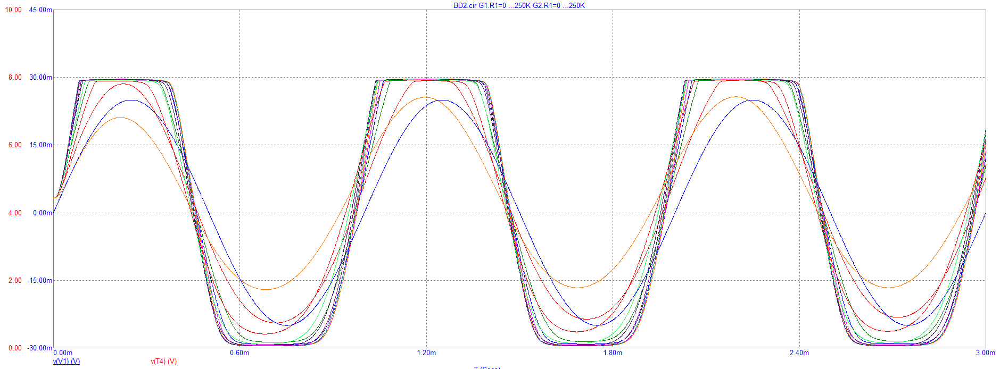

<!-- Spelling and grammar checked -->
# About Wsprry Pi

WsprryPi creates a very simple WSPR beacon on your Raspberry Pi by generating a Pulse-Width Modulation (PWM) square-wave signal through a General-Purpose Input/Output (GPIO) pin on a Raspberry Pi.  This is connected through a [Low-Pass Filter to remove harmonics](https://www.nutsvolts.com/magazine/article/making\_waves\_) and then to an appropriate antenna.  It operates on LF, MF, HF, and VHF bands from 0 to 250 MHz.

This image shows a square waveform, with an overlay showing how a waveform might look through successive low-pass filters:

Image from [https://analogisnotdead.com/article25/circuit-analysis-the-boss-bd2](https://analogisnotdead.com/article25/circuit-analysis-the-boss-bd2)

You should not use Wsprry Pi without a low-pass filter, as it will create interference from harmonics on other bands.

This software is compatible with the original Raspberry Pi, the Raspberry Pi 2/3, the Raspberry Pi 4, and the Pi Zero.

## Attribution

This idea likely originated from an idea Oliver Mattos and Oskar Weigl presented at the PiFM project.  While the website is no longer online, the Wayback Machine has [the last known good version]( http://web.archive.org/web/20131016184311/http://www.icrobotics.co.uk/wiki/index.php/Turning_the_Raspberry_Pi_Into_an_FM_Transmitter).

The original PiFM code is still hosted by the icrobotics.co.uk website.  However, I suspect the domain has fallen into disrepair and may be unsafe, and no direct links are provided here.  You can use the URL above to see the site; should the code disappear, I have [saved it here](https://github.com/lbussy/WsprryPi/raw/refs/heads/main/historical/pifm.tar.gz).

After a conversation with Bruce Raymond of TAPR, I forked @threeme3's repo and provided some rudimentary installation capabilities and associated orchestration.  Version 1.x of this project was a fork of threeme3/WsprryPi (no longer on GitHub), licensed under the GNU General Public License v3 (GPLv3).  The original project is no longer maintained.

In late 2024, George [K9TRV] of TAPR contacted me about some questions related to using WsprryPi on the Pi 5.  While I have not yet made that jump, the conversation spurred me to discard the original code in favor of a more modern, extensible, and maintainable base.

Version 2.0+ is rewritten from scratch, no longer a derivative work, and released under the MIT license.

My goal, and where success will be determined, is to allow you to execute one command on your Pi to install and run the Wsprry Pi software.  If you are lucky and have been living right, a radio wave will hit the cosmos and be received [somewhere else](https://wsprnet.org).
