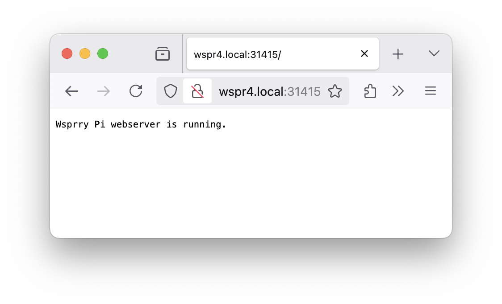

<!-- Grammar and spelling checked -->
# Advanced Operations

Everyone wants to know what's behind the curtain.  These topics cover some underlying controls and issues related to WSPR and `wsprrypi` operations.

## Transmission Timing

This software uses system time to determine the start of WSPR transmissions, so keep the system time synchronized within 1-second precision, i.e., use NTP network time synchronization or set the time manually with the `date` command.  A WSPR broadcast starts on an even minute and takes 2 minutes.

## Frequency Calibration

The system will use NTP calibration by default (via `chrony`) and produce a frequency error of about 0.1 PPM after the Pi has temperature stabilized and the NTP loop has converged.

Frequency calibration is required to ensure the WSPR transmission occurs within the narrow 200 Hz band.  The reference crystal on your RPi might have a frequency error (which, in addition, is temperature dependent -1.3Hz/deg C @10MHz).  You may choose to manually correct the frequency or add a PPM correction on the command line to calibrate the transmission.  In my experience, the NTP-Synch is more than good enough.

### NTP Calibration

NTP automatically tracks and calculates a PPM frequency correction.  If running NTP on your Pi, use the `--use-ntp` option to have this program query NTP for the latest frequency correction before each WSPR transmission.  Some residual frequency errors may still be present due to delays in the NTP measurement loop, and this method works best if your Pi has been on for a long time, the crystal's temperature has stabilized, and the NTP control loop has converged.

In version 2.0, the Pi's default `ntpd` is removed and replaced with `chrony`.  In testing, and I mean a lot of manual testing, I got myself into predicaments where `ntpd` would wind up and not reset itself even after a reboot.  [Chrony](https://chrony-project.org/) is an NTP implementation that worked better for me and is more well-suited for this application.

### AM Calibration

A practical way to calibrate is to tune the transmitter to the same frequency as a medium-wave AM broadcast station, keep tuning until zero-beat (the constant audio tone disappears when the transmitter is precisely on the same frequency as the broadcast station), and determine the frequency difference with the broadcast station.  This difference is the frequency error that can be applied for correction while tuning on a WSPR frequency.

Suppose your local AM radio station is at 780kHz.  Use the `--test-tone` option to produce different tones around 780kHz (e.g., 780100 Hz) until you can successfully zero-beat the AM station.  If the zero-beat tone specified on the command line is F, calculate the PPM correction required as `ppm=(F/780000-1)*1e6`.  In the future, specify this value as the argument to the `--ppm` option on the command line.  You can verify that the ppm value has been set correction by specifying `--test-tone 780000 --ppm \<ppm\>` on the command line and confirming that the Pi is still zero beating the AM station.

## INI File

System daemon operations will read the `wsprrypi.ini` file to supply execution parameters.  During everyday use, there should be no reason to edit the file directly.  The Wsprry Pi installer stores the file in the user data directory:

``` bash
$ ls -al /usr/local/etc
total 12
drwxr-xr-x  2 root root 4096 Feb 18 14:51 .
drwxr-xr-x 10 root root 4096 Sep 21 19:02 ..
-rw-rw-rw-  1 root root  171 Mar  6 19:47 wsprrypi.ini
```

The INI file is a standard INI file with which you may already be familiar.  It has four sections, Control, Common, Extended, and Server.  The application will ignore blank lines and other whitespaces.  The settings are in a key/value pair separated by an equals sign.

This is the default INI file that ships with the installation.  Any comments in the file must begin with a semicolon (`;`).

```ini
; Created for WsprryPi version 2.0
; Copyright (C) 2023-2025 Lee C. Bussy (@LBussy)

; Edit the values below as needed.  Do not remove sections or keys.

[Control]
; Transmit: Set to True to enable transmitting, False to disable.
Transmit = true

[Common]
; Call Sign: Your ham radio call sign (maximum 7 characters).
Call Sign = AA0NT
; Grid Square: Your location's Maidenhead grid square (4 characters).
Grid Square = EM18
; TX Power: Transmitter power in dBm (integer, e.g., 20).
TX Power = 20
; Frequency: Transmission frequency in meters (e.g., '20m') or Hz (e.g., '450000000').
Frequency = 40m
; Transmit Pin: The GPIO pin for WSPR transmissions (BCM numbering).
Transmit Pin = 4

[Extended]
; PPM: Frequency offset in parts per million (floating-point).
PPM = 0
; Use NTP: Calibrate tones via NTP
Use NTP = true
; Offset: Set to True to enable frequency offset correction, False to disable.
Offset = true
; Use LED: Set to True to enable LED usage, False to disable.
Use LED = true
; LED Pin as a GPIO/BCM designation, e.g., Pin 12/GPIO18/BCM18 = 18
LED Pin = 18
; Power Level: Output power level (integer from 0 to 7, where 7 is maximum).
Power Level = 0

[Server]
; Port used for REST interface
Web Port = 31415
; Port used for websockets
Socket Port = 31416
; Use Shutdowwn: Set to True to enable shutdown button, False to disable.
Use Shutdown = true
; PIN (BCM) used for shutdown watcher
Shutdown Button = 19
```

## REST and Web Sockets

Wsprry Pi 2.x introduces a REST API and a Web Socket.

### REST API

The executable exposes a REST API on port `31415` by default.  A health check may be executed to `{servername.local):31415`:



One may `GET` the parameters `{servername.local:31415/config`, and a `PUT` in the correct JSON format will patch the configuration.  The whole JSON payload is similar to:

```json
{
    "Common": {
        "Call Sign": "AA0NT",
        "Frequency": "40m",
        "Grid Square": "EM18",
        "TX Power": 20,
        "Transmit Pin": 4
 },
    "Control": {
        "Transmit": true
 },
    "Extended": {
        "LED Pin": 18,
        "Offset": true,
        "PPM": 0.0,
        "Power Level": 0,
        "Use LED": true,
        "Use NTP": true
 },
    "Meta": {
        "Center Frequency Set": [],
        "Date Time Log": true,
        "INI Filename": "/usr/local/etc/wsprrypi.ini",
        "Loop TX": false,
        "Mode": "WSPR",
        "TX Iterations": 0,
        "Test Tone": 730000.0,
        "Use INI": true
 },
    "Server": {
        "Shutdown Button": 19,
        "Socket Port": 31416,
        "Use Shutdown": true,
        "Web Port": 31415
 }
}
```

You may also `GET` the version JSON at `{servername.local:31415/version`:

```json
{
    "wspr_version": "1.2.1-2-0-devel+1bfaecb (2-0-devel)"
}
```

### Web Socket

The executable exposes a Web Socket on port `31416` by default.  The available commands are:

- `get_tx_state`: The server will respond with `{"tx_state": true}` (or false).
- `reboot`: The server will respond with `{"command": "reboot"}` and reboot the server.
- `shutdown`: The server will respond with `{"command": "shutdown"}` and shutdown the server.

So long as the connection is maintained, the server will broadcast certain events to connected clients:

- **Configuration Reload:L** Tells connected clients that the INI file has been updated and to reload the cached configuration.  This message takes the form of:
    `{"state":"reload","timestamp":"2025-05-06T16:43:02Z","type":"configuration"}`
- **Transmission Start:** Tells connected clients that a transmission has started.  This message takes the form of:
    `{"state":"starting","timestamp":"2025-05-06T16:40:01Z","type":"transmit"}`
- **Transmission Complete:** Tells connected clients that a transmission has finished.  This message takes the form of:
    `{"state":"finished","timestamp":"2025-05-06T16:41:51Z","type":"transmit"}`

## PWM Peripheral

The code uses the RPi PWM peripheral to time the frequency transitions of the output clock. The RPi sound system also uses this peripheral; hence, any system sound events during a WSPR transmission will interfere with WSPR transmissions. Sound can be permanently disabled by editing `/etc/modules` and commenting out the `snd-bcm2835` device. This is done by the install script, and most users will not need to worry about it.

## RF And Electrical Considerations

The output of the Pi's PWM is a square wave, so a low-pass filter is REQUIRED.  Knowing why this is required is part of learning to be a ham.  Connect a low-pass filter (via a decoupling capacitor) to GPIO4 (GPCLK0) and the Ground pin of your Raspberry Pi and connect an antenna to the LPF.  The GPIO4 and GND pins are found on the main header on pins 7 and 9, respectively; the pin closest to the P1 label is pin 1, and its 3rd and 4th neighbor is pin 7 and 9, respectively.  See [this link](http://elinux.org/RPi\_Low-level\_peripherals) for pin layout.

Examples of low-pass filters can be [found here](http://www.gqrp.com/harmonic\_filters.pdf) (PDF link).  TAPR makes a [very nice shield for the Raspberry Pi](https://www.tapr.org/kits\_20M-wsprrypi-pi.html) that is pre-assembled, performs the appropriate filtering for the selected band, and also amplifies the power output to 20dBm.  Just connect your antenna, and you're good to go.

The expected power output from the Pi is configurable at the command line or via the Web UI. When connected to a simple dipole antenna, this small amount of power may result in reception reports ranging up to several thousand kilometers.

As the Raspberry Pi does not attenuate ripple and noise components from the 5V USB power supply, you should use a regulated supply with sufficient ripple suppression.  You may see a supply ripple as mixing products centered around the transmit carrier, typically at 100/120Hz.

Do not expose GPIO4 to voltages or currents above the Absolute Maximum limits.  GPIO4 outputs a digital clock in 3V3 logic, with a maximum current of 16mA.  As no current protection is available and the system uses a DC component of 1.6V, do not short-circuit or place a resistive (dummy) load straight on the GPIO4 pin, as it may draw too much current.  Instead, use a decoupling capacitor to remove the DC component when connecting the output dummy loads, transformers, antennas, etc.  Do not expose GPIO4 to electrostatic voltages or voltages exceeding the 0 to 3.3V logic range; connecting an antenna directly to GPIO4 may damage your RPi due to transient voltages such as lightning or static buildup as well as RF from other transmitters operating into nearby antennas.  Therefore, adding some form of isolation is recommended, e.g., using an RF transformer, a simple buffer/driver/PA stage, or two Schottky small signal diodes back-to-back.
