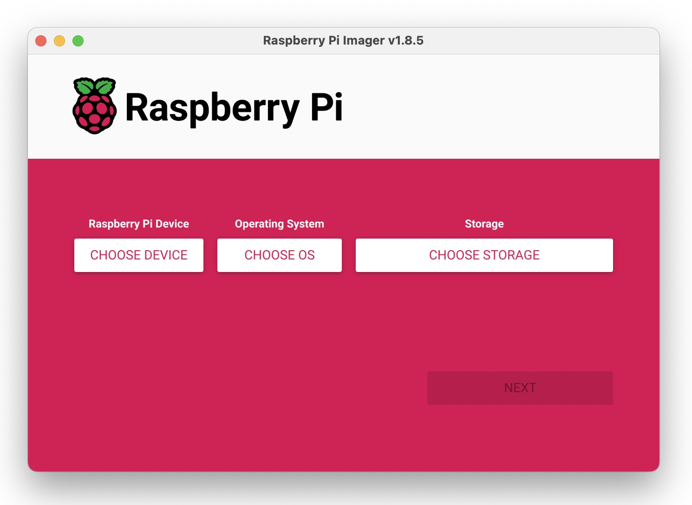
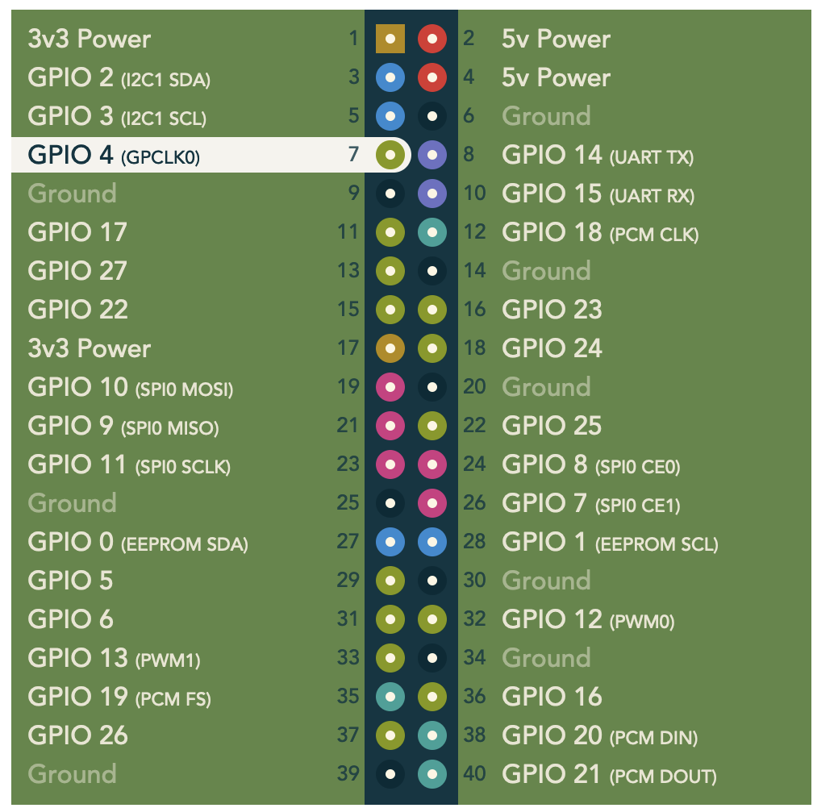

<!-- Grammar and spelling checked -->
# Installing Wsprry Pi

## Gather Hardware

You will need the following:

- A Raspberry Pi
- An SD card for the OS image
- A power supply for the Pi.  Pay attention here to potentially noisy power supplies.  You will benefit from a well-regulated supply with sufficient ripple suppression.  You may see supply ripple as mixing products centered around the transmit carrier, typically at 120Hz (60Hz mains) and 100Hz (50Hz mains.)

**NOTE: The Raspberry Pi 5 is not supported.**

## Prerequisites

This section may be the most challenging part of the whole installation.  *You must have a working Raspberry Pi with Internet access.* It can be hard-wired or on Wi-Fi.  There is no better place to learn how to set up your new Pi than the people who make it themselves.  [Go here](https://www.raspberrypi.com/documentation/computers/getting-started.html), and learn how to install the operating system with the [Raspberry Pi Imager](https://www.raspberrypi.com/software/).  To enable SSH access, pre-configure your image with your local/time zone, Wi-Fi credentials, and a unique hostname.



I am only testing the current `stable` and `oldstable` versions: Bookworm and Bullseye.

You can use a full-featured desktop version with all the bells and whistles, or Wsprry Pi will run just fine on the Lite version on an SD card as small as 2 GB (although a minimum of 8 GB seems more comfortable these days.)  You can even run it headless without a keyboard, mouse, or monitor.  If you enable SSH, you can use your command line from Windows 10/11, MacOS, or another Pi.

Whatever you do, you will need command line access to your Pi to proceed via ssh or the console.  Once you are up and running and connected to the Internet, you may proceed with Wsprry Pi installation.  Here is a recommended process:

**Open the Raspberry Pi Imager:**

* Choose your Raspberry Pi Device
* Choose your Operating System
* Choose Storage (you should only insert one SD card)
* Next
* At "Use OS Customizations," select "Edit Settings."
  * On the General Tab
    * Set the hostname to something unique on your network (like `wsprrypi`)
    * Set username and password (you must do this, or SSH will not work)
      * Only the username `pi` has been tested
      * Choose a password you can remember
    * Configure wireless LAN
      * SSID is your network name
      * The password is whatever you use
      * Select the proper Wireless LAN country
    * Set Locale settings to your location and keyboard type
  * On the Services Tab
    * Check "Enable SSH"
    * Select "Use Password authentication."
  * Save
  * "Yes" to apply customizations
* "Yes" to erase media
* Wait for the writer to tell you it is okay to remove the SD card

## System Changes

Aside from the obvious, installing Wsprry Pi, the install script will do the following:

- **Install Apache2**, a popular open-source, cross-platform web server that is the most popular web server by the numbers.  The [Apache Software Foundation](https://www.apache.org/) maintains Apache.  Apache is used to control Wsprry Pi from an easy-to-use web page.  In addition, if you have not used the Apache installation previously, a redirect from the root of the webserver to `/wsprrypi/` will be created for ease of use.  Finally, the script creates three proxies to communicate from the web page to the application:
  - `http://127.0.0.1:31415/config` to `/wsprrypi/config` for getting/setting the configuration
  - `http://127.0.0.1:31415/version` to `/wsprrypi/version` to retrieve the running version.
  - `ws://127.0.0.1:31416/socket` to `/wsprrypi/socket` for Web Socket communications.
- **Install Chrony**, [a replacement for ntpd](https://chrony-project.org/).
- **Install PHP**, a popular general-purpose scripting language especially suited to web development.  The [PHP Group](https://www.php.net/) maintains PHP.  I wrote the web pages in PHP.
- **Install Raspberry Pi development libraries and other Packages**, `git`, and `libgpiod2`.
- **Compile and configure Wsprry Pi**
- **Disable the Raspberry Pi's built-in sound card.** Wsprry Pi uses the RPi PWM peripheral to time the frequency transitions of the output clock.  The Pi's sound system also uses this peripheral; any sound events during a WSPR transmission will interfere with WSPR transmissions.

## Install WSPR

You may use this command to install Wsprry Pi (one line):

`curl -fsSL installwspr.aa0nt.net | sudo bash`

This shorter URL relies on my hosted DNS for a redirect to GitHub.  If my DNS is broken for some reason, you may see an error like this:

`curl: (22) The requested URL returned error: 404`

If that happens, this longer form should work:

`curl -fsSL https://raw.githubusercontent.com/lbussy/WsprryPi/refs/heads/main/scripts/install.sh | sudo bash`

This install command is idempotent; running it additional times will not have any negative impact.  If an update is released, re-run the installer to take advantage of the new release.

I have GREATLY simplified the installer since version 1.x.  Here is more or less what you will see:

```text
[INFO ] Checking environment.
[INFO ] System: Debian GNU/Linux 12 (bookworm).
[INFO ] Running Wsprry Pi's 'install.sh', version 2.0.1-64-bit+6.a4a0da8-dirty
[INFO ] Updating and managing required packages (this may take a few minutes).
[  ✔  ] Complete: Update local package index.
[  ✔  ] Complete: Fixing broken or incomplete package installations.
[  ✔  ] Complete: Upgrade git.
[  ✔  ] Complete: Upgrade apache2.
[  ✔  ] Complete: Upgrade php.
[  ✔  ] Complete: Upgrade chrony.
[  ✔  ] Complete: Upgrade libgpiod2.
[INFO ] APT package handling completed successfully.
[INFO ] Wsprry Pi installation beginning.
[INFO ] Destination directory already exists: '/home/pi/WsprryPi'
[INFO ] Cleaning up older services.
[  ✔  ] Complete: Resetting failed systemd states.
[  ✔  ] Complete: Reloading systemd daemon.
[INFO ] Cleaning up older files and directories.
[  ✔  ] Complete: Compile debug binary (this may take several minutes).
[  ✔  ] Complete: Moving binary to staging.
[INFO ] Installing wsprrypi_debug.
[  ✔  ] Complete: Install application.
[  ✔  ] Complete: Change ownership on application.
[  ✔  ] Complete: Make app executable.
[INFO ] Installing 'wsprrypi' configuration.
[INFO ] Merged /usr/local/etc/wsprrypi.ini into new config.
[  ✔  ] Complete: Remove old INI after merge.
[  ✔  ] Complete: Install configuration.
[  ✔  ] Complete: Change ownership on configuration.
[  ✔  ] Complete: Set config permissions.
[INFO ] Updating systemd service: wsprrypi.service.
[  ✔  ] Complete: Disable systemd service.
[  ✔  ] Complete: Stop systemd service.
[  ✔  ] Complete: Removing old unit in /etc.
[  ✔  ] Complete: Copy systemd file.
[  ✔  ] Complete: Change ownership on systemd file.
[  ✔  ] Complete: Change permissions on systemd file.
[  ✔  ] Complete: Create log path.
[  ✔  ] Complete: Change ownership on log path.
[  ✔  ] Complete: Change permissions on log path.
[  ✔  ] Complete: Enable systemd service.
[  ✔  ] Complete: Reload systemd.
[  ✔  ] Complete: Start systemd service.
[  ✔  ] Complete: Change ownership on logs.
[  ✔  ] Complete: Change permissions on logs.
[INFO ] Systemd service wsprrypi created.
[INFO ] Installing 'logrotate' configuration.
[  ✔  ] Complete: Install configuration.
[  ✔  ] Complete: Change ownership on configuration.
[  ✔  ] Complete: Set config permissions.
[INFO ] Installing web files to '/var/www/html/wsprrypi'.
[  ✔  ] Complete: Create target web directory.
[  ✔  ] Complete: Copy web files.
[  ✔  ] Complete: Set ownership.
[  ✔  ] Complete: Set directory permissions.
[  ✔  ] Complete: Set file permissions.
[  ✔  ] Complete: Delete merged INI source.
[INFO ] Running from repo, skipping cleanup.
[  ✔  ] Complete: Adding ServerName directive.
[  ✔  ] Complete: Writing /etc/apache2/sites-available/wsprrypi.conf.
[  ✔  ] Complete: Enable Apache modules.
[  ✔  ] Complete: Disabling default site.
[  ✔  ] Complete: Enabling wsprrypi site.
[  ✔  ] Complete: Testing Apache configuration.
[  ✔  ] Complete: Reloading Apache.
```

You may see:

```text
*Important Note:*

Wsprry Pi uses the same hardware as the sound system to generate
radio frequencies.  This soundcard has been disabled.  You must
reboot the Pi with the following command after install for this
to take effect:

'sudo reboot'

Press any key to continue.
```

The installation will finish with:

```text
Installation successful: Wsprry Pi.

To configure Wsprry Pi, open the following URL in your browser:

 http://wspr4.local/wsprrypi
 http://10.0.0.68/wsprrypi

If the hostname URL does not work, try using the IP address.
Ensure your device is on the same network and that mDNS is
supported by your system.
```

If the script prompts you to reboot, do that now.  At this point (and if you rebooted if prompted), Wsprry Pi is installed and running.

Note the URL for the configuration UI listed as a `{name}.local` and IP address choice.  You can access your system with the `{name}.local` names without remembering the IP address.  The `{name}.local` is convenient for automatically assigned IP addresses in most home networks.  The IP address of your Raspberry Pi may change over time, but the name will not.

Some Windows systems can use this naming standard without additional work, but others may need to install Apple's [Bonjour Print Services](https://support.apple.com/kb/dl999) to enable this helpful tool.  If you get a host hot found error, try installing Bonjour.

Connect to your new web page from your favorite computer or cell phone with the IP address or the `{name}.local` name, and you can begin to set things up.  See Operations for more information.

## Additional Hardware

While the TAPR Hat is optional, an antenna is not.  Choosing an antenna is beyond the scope of this documentation, but you can use something as simple as a random wire connected to the GPIO4 pin (GPCLK0), which is numbered `7` on the header.


