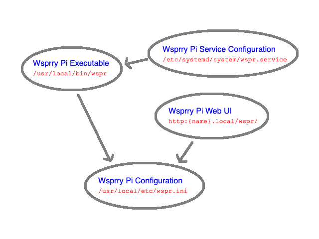

# Wsprry Pi System Internals

The system consists of the following:

- `wsprrypi` (executable): Installed to `/user/local/bin/wsprrypi`
- `wsprrypi.ini` (configuration): Installed to `/user/local/etc/wsprrypi.ini`
- `wsprrypi.service` (service control file): Installed to `/etc/systemd/system/wsprrypi.service`
- Wsprry Pi Web UI: Installed to `/var/www/html/wsprrypi`

If you choose to use the TAPR board-supplied shutdown button, the following files are also part of the system:

- `shutdown-button.py` (Python script): Installed to `/user/local/bin/shutdown-button.py`
- `shutdown-button.service` (service control file): Installed to `/etc/systemd/system/shutdown-button.service`

The primary data flow is as follows:

## Log Files

The `wsprrypi` service will log messages to transmission and error logs. As of version 1.1.0, these log files will move out of the system log and into four separate logs:

- `/var/log/wsprrypi/wsprrypi.transmit.log`: The standard log showing informational messages about the wsprrypi process and transmissions.
- `/var/log/wsprrypi/wsprrypi.error.log`: Any errors or warnings logged by the wsprrypi process.
- `/var/log/wsprrypi/shutdown-button.transmit.log`: If enabled, this log will show any messages from the system shutdown daemon connected to the shutdown button.
- `/var/log/wsprrypi/shutdown-button.error.log`: If enabled, this log will show any errors or warnings from the system shutdown daemon.

You may review these text files with standard Linux tools:

- `cat /var/log/wsprrypi/wsprrypi.transmit.log`: Print the log's contents to the screen.
- `more /var/log/wsprrypi/wsprrypi.transmit.log`: View the log using the system paging feature (`man more` for more details).
- `tail -f /var/log/wsprrypi/wsprrypi.transmit.log`: Show the end of the log and continue to show new lines as they are logged (`man tail` for more information.)

The `logd` daemon rotates the logs on the following schedule:

- `wsprrypi.transmit.log` and `wsprrypi.error.log` are rotated daily, the old log is compressed, and 14 logs are retained (14 days.)
- `shutdown-button.transmit.log` and `shutdown-button.error.log` are rotated monthly (if they have contents,) the old log is compressed, and 12 logs are retained (12 months.)
