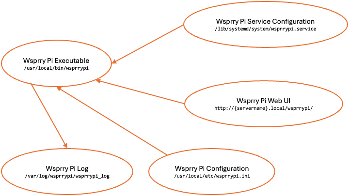

<!-- Grammar and spelling checked -->
# Wsprry Pi System Internals

The system consists of the following:

- `wsprrypi` (executable): Installed to `/user/local/bin/wsprrypi`
- `wsprrypi.ini` (configuration): Installed to `/user/local/etc/wsprrypi.ini`
- `wsprrypi.service` (service control file): Installed to `/lib/systemd/system/wsprrypi.service`
- Wsprry Pi Web UI: Installed to `/var/www/html/wsprrypi`

The primary data flow is as follows:

## Log Files

As of 2.x, the `wsprrypi` service will log messages to a single log. `/var/log/wsprrypi/wsprrypi_log`.

You may review these text files with standard Linux tools:

- `cat /var/log/wsprrypi/wsprrypi_log`: Print the log's contents to the screen.
- `more /var/log/wsprrypi/wsprrypi_log`: View the log using the system paging feature (`man more` for more details).
- `tail -f /var/log/wsprrypi/wsprrypi_log`: Show the end of the log and continue to show new lines as they are logged (`man tail` for more information.)
- You may also view the live log file via the web UI.

The `logd` daemon rotates the log daily, compresses the old log, and retains 14 logs (14 days).
