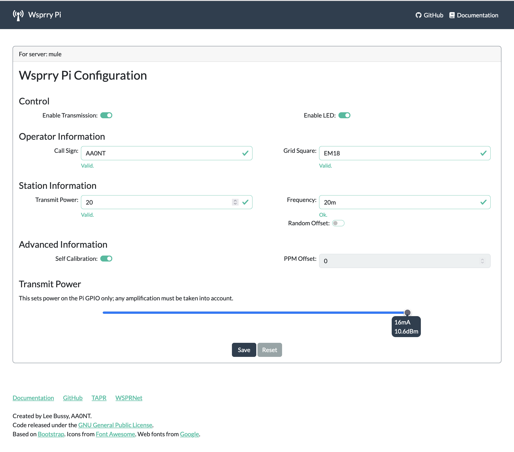

# Wsprry Pi Operations

All normal control operations in typical usage revolve around the Wsprry Pi's configuration file. This file is manipulated by a web UI and accessed by the `wspr` executable. If wspr is running, a change to this file will take effect at the next transmission period, which is the top of an even minute for normal WSPR, or at the top of the quarter hour for -15 operations. If wspr is not actively transmitting and the transmit selection is changed, it will begin at the next proper WSPR window.

## Web Interface

The web interface is designed to be a simple-to-use yet comprehensive interface to the wspr program.



Since the wspr application runs as a system daemon, a configuration is saved by the web page and picked up immediately by the wspr application.

Configuration items:

- Control
  - Enable Transmission
    - Off: While the transmission is disabled, the wspr program will still run and monitor the configuration for changes.
    - On: The wspr program will transmit based on the saved configuration.
  - Enable LED: The TAPR Pi Hat includes a red LED attached to Pin 12 (GPIO18, BCM18). When enabled, this LED will light during transmission.
- Operator Information
  - Call Sign: This should be your registered callsign. Please do not make things up or use another person's callsign. It is illegal and immoral, and you will eventually annoy someone enough for them to find and report you.
  - Grid Square: The Maidenhead Locator System coordinates, also called QTH locators, grid locators, or grid squares. This is the first four digits only; two letters followed by two numbers.
- Station Information
  - Transmit Power: Transmit power in dBm. This is an informational item for the WSPR packet and has no bearing on the energy used to transmit the message. Typically, this value is 10, representing the Raspberry Pi's signal power capability. If you are using the TAPR hat, it includes an amplifier raising this dBm level to 20.
  - Frequency: Frequencies can be specified as an absolute TX carrier frequency (e.g., 14097100 for 20-meter WSPR) or using one of the strings in the table below. If you use a string, the transmission will happen in the middle of the WSPR region of the selected band. You may use multiple frequencies separated by spaces; wspr will iterate through them in order. A 0 as a frequency is used in a frequency list to establish a transmission window gap.

| Frequency Designator | Frequency in Hz |
| --- | --- |
| LF | 137500 |
| LF-15\* | 137612.5 |
| MF | 475700 |
| MF-15 | 475812.5 |
| 160m | 1838100 |
| 160m-15\* | 1838212.5 |
| 80m | 3570100 |
| 60m | 5288700 |
| 40m | 7040100 |
| 30m | 10140200 |
| 20m | 14097100 |
| 17m | 18106100 |
| 15m | 21096100 |
| 12m | 24926100 |
| 10m | 28126100 |
| 6m | 50294500 |
| 4m | 70092500 |
| 2m | 144490500 |

\*The `-15` suffix indicates the WSPR-15 region of the band.

  - Random Offset: Add a random frequency offset to each transmission:
    - +/- 80 Hz for WSPR
    - +/- 8 Hz for WSPR-15
- Advanced Information: These two items are exclusive. If Self-Calibration is enabled, PPM Offset will be ignored.
  - Self-Calibration: Uses an NTP check before every transmission to obtain the PPM error of the Raspberry Pi's crystal.
  - PPM Offset: An advanced setting to allow manual configuration of the Raspberry Pi's crystal offset.
- Save: Applies the currently displayed configuration. If any fields fail the basic checks, the field will be red and not allow saving. The changes may not immediately change what wspr is doing; if wspr is actively transmitting, any configuration change will be applied after the transmission window ends.
- Reset: Reloads the configuration page from the system.

## Command Line Interface

------>>> TODO:
Please note that `wspr` is a singleton application by design.  Should you wish to operate it from the command line, you will need to stop the daemon using the instructions in 

Should you desire to run wspr from the command line, a complete listing of command line options is available by executing `(sudo) /usr/local/bin/wspr -h`:

```
Usage:
  wspr [options] callsign locator tx_pwr_dBm f1 <f2> <f3> ...
    OR
  wspr [options] --test-tone f

Options:
  -h --help
    Print out this help screen.
  -v --version
    Show Wsprry Pi version.
  -p --ppm ppm
    Known PPM correction to 19.2MHz RPi nominal crystal frequency.
  -s --self-calibration
    Check NTP before every transmission to obtain the PPM error of the
    crystal (default setting.).
  -f --free-running
    Do not use NTP to correct frequency error of RPi crystal.
  -r --repeat
    Repeatedly, and in order, transmit on all the specified command line
    freqs.
  -x --terminate <n>
    Terminate after n transmissions have been completed.
  -o --offset
    Add a random frequency offset to each transmission:
      +/- 80 Hz for WSPR
      +/- 8 Hz for WSPR-15
  -t --test-tone freq
    Simply output a test tone at the specified frequency. Only used for
    debugging and to verify calibration.
  -l --led
    Use LED when transmitting (TAPR board).
  -n --no-delay
    Transmit immediately, do not wait for a WSPR TX window. Used for
    testing only.
  -i --ini-file
    Load parameters from an ini file. Supply path and file name.
  -D --daemon-mode
    Run with terse messaging.

Frequencies can be specified either as an absolute TX carrier frequency,
or using one of the following strings:

  LF, LF-15, MF, MF-15, 160m, 160m-15, 80m, 60m, 40m, 30m, 20m,
  17m, 15m, 12m, 10m, 6m, 4m, and 2m

If a string is used, the transmission will happen in the middle of the
WSPR region of the selected band.

The "-15" suffix indicates the WSPR-15 region of band.

Transmission gaps can be created by specifying a TX frequency of 0.
```

### Command Line Entries for Testing

You may transmit a constant test tone at a specific frequency for testing. In this example, a tone will be transmitted at 780 kHz (780000 Hz):

`wspr --test-tone 780e3`

### Example Usage

Remember that anything that creates a transmission will require you to use `sudo`.

`wspr --help`

Display a brief help screen.

`wspr --test-tone 780e3`

Transmit a constant test tone at 780 kHz.

`wspr N9NNN EM10 33 20m`

Using callsign N9NNN, locator EM10, and TX power 33 dBm, transmit a single WSPR transmission on the 20m band using NTP-based frequency offset calibration.

`wspr --led N9NNN EM10 33 20m`

The same as above but using the red LED on transmit (TAPR Hat) to indicate an active transmission. The LED is connected to Pin 12 (GPIO18, BCM18).

`wspr --free-running N9NNN EM10 33 20m`

The same as above, but without NTP calibration.

`wspr --repeat --terminate 7 --ppm 43.17 N9NNN EM10 33 10140210 0 0 0 0`

Transmit a WSPR transmission slightly off-center on 30m every 10 minutes for a total of 7 transmissions, and using a fixed PPM correction value.

`wspr --repeat --offset --self-calibration N9NNN EM10 33 40m`

Transmit repeatedly on 40m, use NTP-based frequency offset calibration, and add a random frequency offset to each transmission to minimize collisions with other transmitters.

## Transmission Timing

This software uses system time to determine the start of WSPR transmissions, so keep the system time synchronized within 1-second precision, i.e., use NTP network time synchronization or set the time manually with the `date` command. A WSPR broadcast starts on an even minute and takes 2 minutes for WSPR-2 or begins at minutes 0, 15, 30, and 45 and takes 15 minutes for WSPR-15.

## Calibration

NTP calibration is enabled by default and produces a frequency error of about 0.1 PPM after the Pi has temperature stabilized and the NTP loop has converged.

Frequency calibration is required to ensure that the WSPR-2 transmission occurs within the narrow 200 Hz band. The reference crystal on your RPi might have a frequency error (which, in addition, is temperature dependent -1.3Hz/deg C @10MHz). You may manually correct the frequency or add a PPM correction on the command line to calibrate the transmission.

### NTP Calibration

NTP automatically tracks and calculates a PPM frequency correction. If you are running NTP on your Pi, you can use the `--self-calibration` option to have this program query NTP for the latest frequency correction before each WSPR transmission. Some residual frequency errors may still be present due to delays in the NTP measurement loop, and this method works best if your Pi has been on for a long time, the crystal's temperature has stabilized, and the NTP control loop has converged.

### AM Calibration

A practical way to calibrate is to tune the transmitter on the same frequency as a medium wave AM broadcast station, keep tuning until zero-beat (the constant audio tone disappears when the transmitter is precisely on the same frequency as the broadcast station), and determine the frequency difference with the broadcast station. This difference is the frequency error that can be applied for correction while tuning on a WSPR frequency.

Suppose your local AM radio station is at 780kHz. Use the `--test-tone` option to produce different tones around 780kHz (e.g., 780100 Hz) until you can successfully zero-beat the AM station. If the zero-beat tone specified on the command line is F, calculate the PPM correction required as `ppm=(F/780000-1)*1e6`. In the future, specify this value as the argument to the `--ppm` option on the command line. You can verify that the ppm value has been set correction by specifying `--test-tone 780000 --ppm \<ppm\>` on the command line and confirming that the Pi is still zero beating the AM station.

## PWM Peripheral

The code uses the RPi PWM peripheral to time the frequency transitions of the output clock. The RPi sound system also uses this peripheral; hence, any sound events that occur during a WSPR transmission will interfere with WSPR transmissions. Sound can be permanently disabled by editing `/etc/modules` and commenting out the `snd-bcm2835` device.

## RF And Electrical Considerations

The output of the Pi's PWM is a square wave, so a low-pass filter is REQUIRED. Knowing why this is required is part of learning to be a Ham. Connect a low-pass filter (via a decoupling capacitor) to GPIO4 (GPCLK0) and the Ground pin of your Raspberry Pi and connect an antenna to the LPF. The GPIO4 and GND pins are found on the main header on pins 7 and 9, respectively; the pin closest to the P1 label is pin 1, and its 3rd and 4th neighbor is pin 7 and 9, respectively. See [this link](http://elinux.org/RPi\_Low-level\_peripherals) for pin layout.

Examples of low-pass filters can be [found here](http://www.gqrp.com/harmonic\_filters.pdf) (PDF link). TAPR makes a [very nice shield for the Raspberry Pi](https://www.tapr.org/kits\_20M-wspr-pi.html) that is pre-assembled, performs the appropriate filtering for the selected band, and also amplifies the power output to 20dBm. Just connect your antenna, and you're good to go.

The expected power output is 10mW (+10dBm) in a 50 Ohm load without the TAPR hat. This power looks negligible, but when connected to a simple dipole antenna, this may result in reception reports ranging up to several thousand kilometers.

As the Raspberry Pi does not attenuate ripple and noise components from the 5V USB power supply, you should use a regulated supply with sufficient ripple suppression. Supply ripple might be seen as mixing products centered around the transmit carrier, typically at 100/120Hz.

Do not expose GPIO4 to voltages or currents above the specified Absolute Maximum limits. GPIO4 outputs a digital clock in 3V3 logic, with a maximum current of 16mA. As there is no current protection available and a DC component of 1.6V, do not short-circuit or place a resistive (dummy) load straight on the GPIO4 pin, as it may draw too much current. Instead, use a decoupling capacitor to remove the DC component when connecting the output dummy loads, transformers, antennas, etc. Do not expose GPIO4 to electrostatic voltages or voltages exceeding the 0 to 3.3V logic range; connecting an antenna directly to GPIO4 may damage your RPi due to transient voltages such as lightning or static buildup as well as RF from other transmitters operating into nearby antennas. Therefore, adding some form of isolation is recommended, e.g., using an RF transformer, a simple buffer/driver/PA stage, or two Schottky small signal diodes back-to-back.
