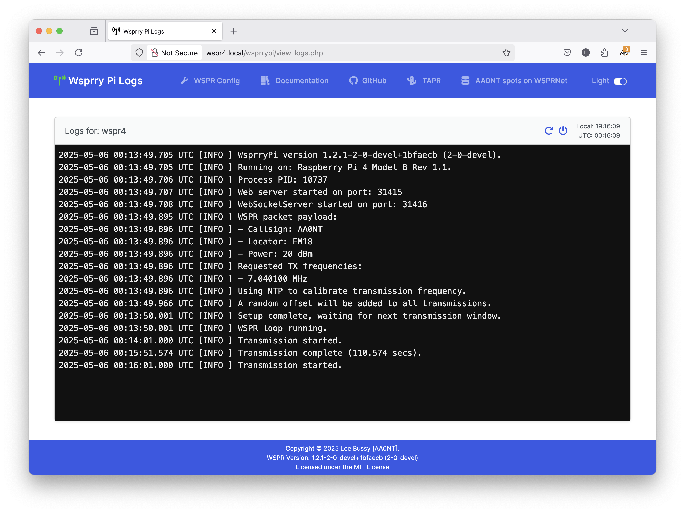

# Web Log Viewer

The logs for Wsprry Pi are maintained in `/var/log/wsprrypi` and auto-rotated by the system to keep them at a manageable size.

```text
drwxr-xr-x 2 root www-data 4.0K May  6 00:00 .
drwxr-xr-x 9 root root     4.0K May  4 11:32 ..
-rw-r--r-- 1 root www-data  31K May  6 07:28 wsprrypi_log
-rw-r--r-- 1 root root     1.5K May  6 00:00 wsprrypi_log.1.gz
```

You can view them live and follow the action using the "WSPR Logs" link in the navbar:



Because these are system logs, the times are in UTC.  I made the calculated guess that most ham operators are well-versed in UTC time, but the local vs UTC time is always there in the top-right corner of the card if needed.
