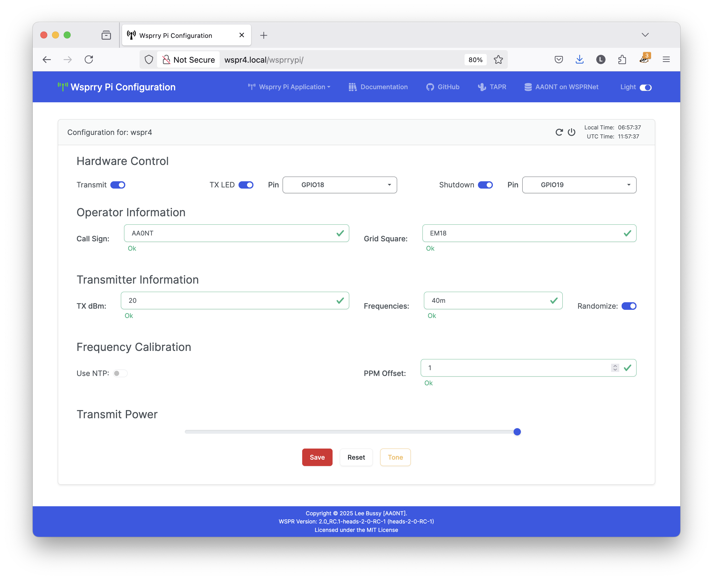
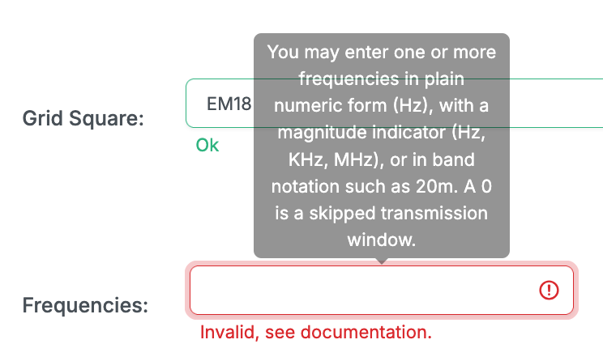
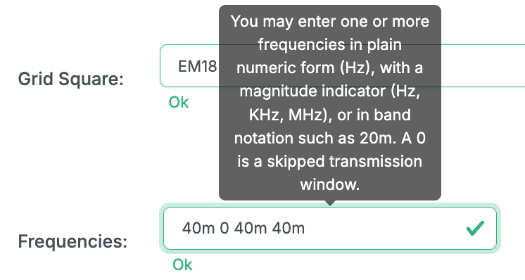
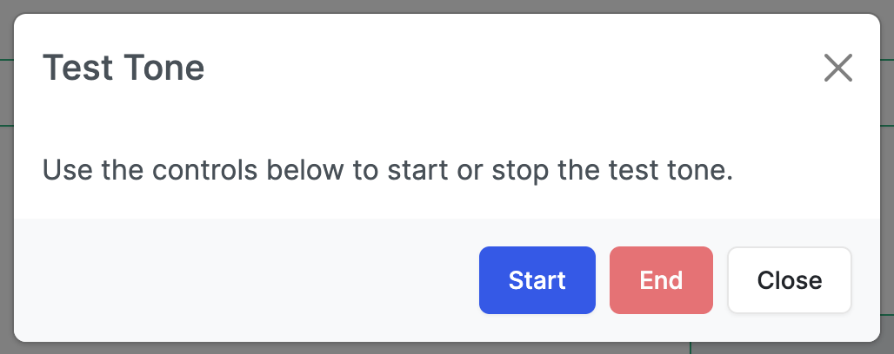

<!-- Grammar and spelling checked -->
# Configuration Card

This card is where all of your settings will happen.  Only two settings are (purposefully) not in the web UI, which will be more than enough for 99.9% of you.

On the left-hand side of the card header, there is an indication of which server you have connected to.  This feature may be helpful for people using multiple rigs.

## Form Validation

You may also notice a form of real-time validation via HTML validation rules.  A red border with an exclamation point on the right side of the form field means the data has failed validation.  The mouse-over tool-tips will inform you what a good entry looks like, and an invalid entry also displays help text in red underneath the field;

When the validation rules are satisfied, the border turns green; the under-field text says "Ok," and a green check mark appears on the right side of the form field.

## Hardware Control

The first row deals with controlling your Pi's input/output functions.

### Transmit

If configured properly when on (darkened and the thumb to the right), the system will transmit.  When turned on, the application will wait for the next transmission window to start.

### Transmission LED

When on (darkened and the thumb to the right), the configured LED will light during transmissions and flash to indicate reboots and shutdowns.  The drop-down allows you to select which pin will energize on transmission.  The default value is GPIO18/Pin 12, which is the proper selection for a TAPR board.  All other available GPIO pins are available for your use; however, you are responsible for ensuring they are appropriate for use and do not conflict with different functions.

### Shutdown Button

When on (darkened and the thumb to the right), the system will monitor a pin (a button on the TAPR board) and shut down the system when pressed/pulled low.  If you have the LED enabled, the LED will flash three times before shutdown.  The drop-down allows you to select which pin will initiate a shutdown when pulled low (connected to ground.)  The default value is GPIO19/Pin 35, which is the proper selection for a TAPR board.  All other available GPIO pins are available for your use; however, you are responsible for ensuring they are appropriate for use and do not conflict with different functions.

## Operator Information

The second row is all about you.

### Call Sign

Here, you will enter your call sign.  According to WSPR documentation, a WSPR Type 1 message only supports six characters.  Those few with longer call signs or who use prefixes and suffixes must make some choices here.  WSPR Type 2 and 3 messages support longer call signs and six-character Maidenhead locators, but those messages are not yet supported.

Validation rules apply to this field.  While somewhat more complex, a call sign has a prefix, a numeric field, and a suffix.  If you have a valid call sign that will not validate, please [raise an issue](https://github.com/lbussy/WsprryPi/issues).

### Grid Square

The grid square, or Maidenhead field, takes a valid four-character Maidenhead designator; these are always two alpha characters followed by two numeric characters.  If you need help finding yours, [this page](https://www.f5len.org/tools/locator/) hosted by Pascal [F5LEN] is quite handy.

## Transmitter Information

Here, you will enter information about your transmitter.

### Transmit Power in dBm

Enter your transmit power in dBm from 0 to 60 (just the number, no "dBm").  According to the WSPR Protocol and for compatibility with WSJT / WSPR software, only specific values will work.  These are just those ending in 0, 3, or 7 (0, 3, 7, 10, 13, 17, 20, 23, 27, 30, 33, 37, 40, 43, 47, 50, 53, 57, or 60).

### Frequencies

Enter one or more frequencies here.  You can enter:

- Numeric value such as 7040100
- Numeric value with modifiers such as 7040.100KHz or 7.040100MHz
- Band indicators such as 40m

Spaces should separate the list; a 0 indicates a transmission gap (no transmission for that 2-minute window.)

A valid entry could be:

`40m 0 40m 40m 40m`

... where the radio will transmit for two minutes, skip the next two minutes, followed by three transmissions.  This sequence will repeat, so this 10-minute sequence example will repeat until you stop it.

### Randomize

Since there may be hundreds (if not more) of people worldwide transmitting WSPR on the same band, you can add a slight random (+/- 8 Hz) offset to your transmission frequency.  This offset will help avoid pileups and likely allow a higher chance of someone decoding your message.  This random number is determined when the transmission cycle starts (transmission is enabled) and remains the same until you cycle the transmitter.

## Frequency Calibration

The fourth row deals with how the transmitter is calibrated (or calibrated itself.) Frequency calibration is expressed in Parts Per Million when working with oscillators.  [This page](https://www.sitime.com/ppm-hz-calculator) has a PPM to Hz and Hz to PPM calculator if you need a reference.

### Use NTP

NTP calibration is an easy mode in which the Pi calculates the PPM variation using Network Time Protocol (NTP).  It is almost always close enough for most people's use.  I can't recall failing to decode a transmission in all the testing I did because my calibration was too far off.

If you turn NTP on, the PPM Offset field is disabled.

### PPM Offset

If Use NTP is disabled, you may manually enter a PPM adjustment for your transmissions here.  It should be a decimal number between -200.000 and 200.000.

## Transmit Power

This slider has eight settings, from 2mA to 16mA, to control the potential output of the GPIO pin forming the transmission.  This setting is only at the Raspberry Pi level and may be higher on some configurations, such as the TAPR board.  For this reason, I have not tied the Transmit Power value in the dBm field to this setting.  You will need to determine what number is appropriate for your WSPR packet.

## Save, Reset, and Test Tone

Finally, you must save your configuration for it to take effect.  If desired, you can cancel any changes, and they will revert to the last saved values.

A "Test Tone" button is also available.  It will cancel any ongoing transmissions and allow you to create a test tone at the frequency (or first frequency in the list) in "Frequencies" and at the power set in "Transmission Power."

When you close the modal, your previous operations will resume on schedule.
