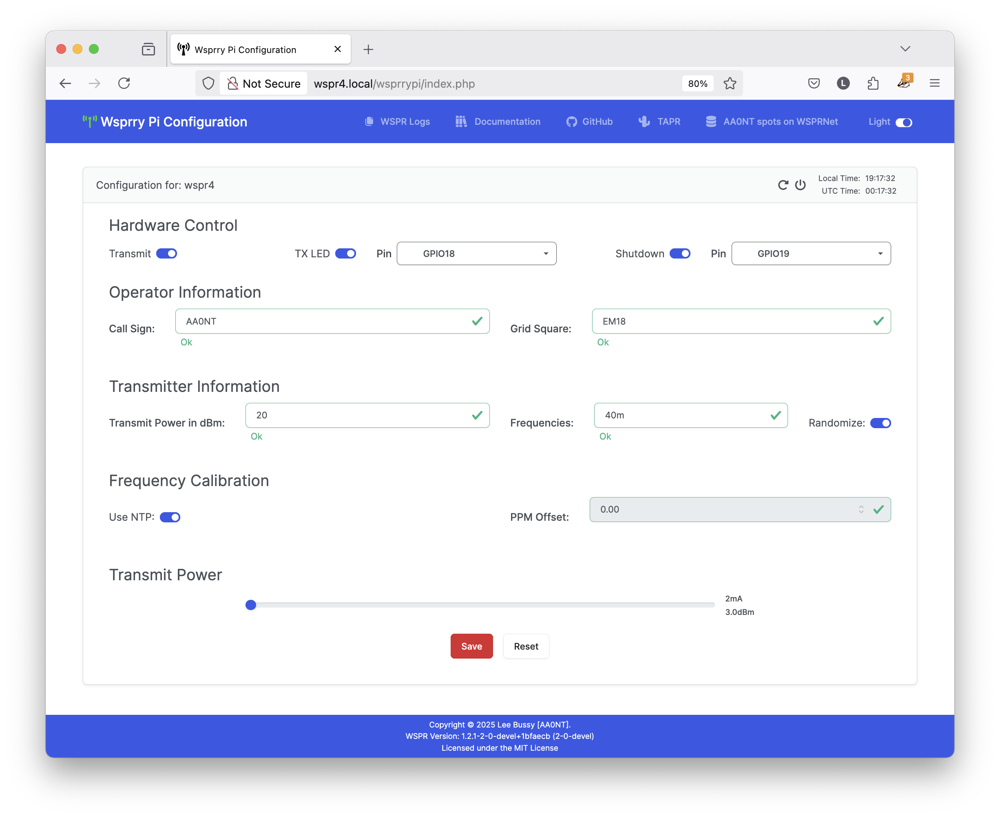
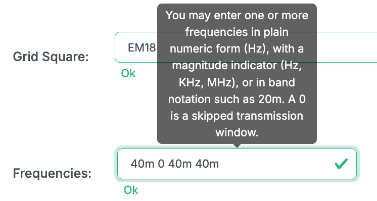
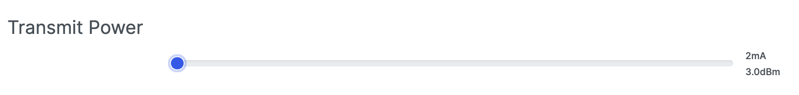
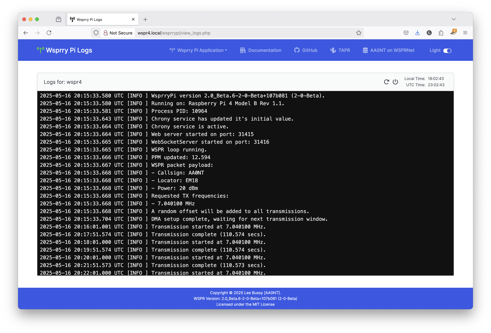

<!-- Grammar and spelling checked -->
# Web UI Operations

The web interface is designed to be a simple-to-use yet comprehensive interface to the Wsprry Pi program and configuration.  I'll explain the UI from top to bottom.

## Navbar

The navbar is the blue bar pinned to the top of the web page:

### Transmission Indicator

The antenna icon turns color depending on the status of the application:

- **Red:** Indicates the web page is disconnected from the application.  The web page was just opened, and the connection to the Web Socket has not yet been negotiated.  The daemon may not be running or remaining started if it remains red.
- **Orange:** Indicates the web page is negotiating the connection to the application.
- **Yellow/Gold:** Indicates the web page is connected to teh application, but no transmission is in progress.
- **Green:** Indicates a transmission is in progress.

For those of you impacted by a type of color-blindness that may make this less valuable, you may hover over the icon for a textual indicator.

### WSPR Links

- **Wsprry Pi Application:** A drop-down is available on each page with links to the Wsprry Pi pages.
- **Documentation:** Opens the online documentation in a new tab.
- **GitHub:** Since this is an open-source project, this links to the source code repository where issues may be raised and where you should consider contributing if you are technically inclined.
- **TAPR:** A link in a new tap to our favorite non-profit 501(c)(3) organization of amateur radio ("ham") operators who are interested in advancing the state of the radio art.
- **WSPRNet Spots:** This will open the WSPRNet database, and if your call sign is configured, it will go directly to your most recent spots.

#### Wsprry Pi Application

Three pages are available here:

- **Configuration:** The main Wsprry Pi page; this is where you will configure and control your rig.
- **Logs:** The log page provides a view of the 500 most recent log entries for the Wsprry Pi daemon.  Full logs from the command line are still available, but this will be enough for most folks' casual use.
- **Spots:** Courtesy of [WSPR Live](https://wspr.live/wspr_downloader.php?), this page will show you your last 60 minutes of spots.  It will also refresh every five minutes, so no manual refreshes are required.  This is a free service, so please do not abuse the service with rapid manual refreshes.

### Web Page Mode

Yes, Virginia, there is a Santa Claus!  New Wsprry Pi now with DARK MODE!

## Card Header

Each page contains a "card," which has a similar header.  The header is the shaded region at the top of the configuration card.

### Card Info

Contextual information about what page/card you are viewing is on the left side of each card header.

#### Server Control

On the top right side before the clock are server control icons:

The icon to the left, the arrow in a circle, is to reboot your Pi.  When you select this, a visual indicator will appear via the transmission LED (if configured).  It will flash two times and then reboot.

The arrow to the right, the circle with the vertical line, will power off the Pi.  When selected, a visual indicator will appear via the transmission LED (if configured).  It will flash three times and then shut down immediately.  Remember that in most configurations, you will need to remove the power and re-power the Pi to start it again.

#### Clock

On the far right side of the card header is a clock displaying both local and UTC time:

## Application Pages / Card Bodies

The card body holds all of the available configuration options.  You may need to scroll to see some.  The layout is also designed to be responsive; that is, it should display in a usable manner on your cell phone and computer screen.

All changes must be saved via the save button before being applied to the system.

### Configuration Card

This is where all of your settings will happen.  Only two settings are (purposefully) not in the web UI, and this will be more than enough for 99.9% of you.

On the left-hand side of the card header, there is an indication of which server you are connected to.  This may be useful for people using multiple rigs.

#### Form Validation

You may also notice a form of real-time validation via HTML validation rules.  A red border with an exclamation point on the right side of the form field means the data has failed validation.  The mouse-over tool-tips will inform you what a good entry looks like, and an invalid entry also displays help text in red underneath the field;

When the validation rules are satisfied, the border turns green, the under-field text says "Ok," and a green check mark will appear on teh right side of the form field.

#### Hardware Control

The first row deals with controlling your Pi's input/output functions.

##### Transmit

If configured properly when on (darkened and the thumb to the right), the system will transmit.  When turned on, the application will wait for the next transmission window to start.

##### Transmission LED

When on (darkened and the thumb to the right), the configured LED will light during transmissions and flash to indicate reboots and shutdowns.  The drop-down allows you to select which pin will be used.  The default value is GPIO18/Pin 12, which is the proper selection for a TAPR board.  All other available GPIO pins are available for your use; however, you are responsible for ensuring they are appropriate for use and do not conflict with different functions.

##### Shutdown Button

When on (darkened and the thumb to the right), the system will monitor a pin (a button on the TAPR board) and shut down the system when pressed/pulled low.  If the LED is configured, the LED will flash three times before shutdown.  The drop-down allows you to select which pin will be used.  The default value is GPIO19/Pin 35, which is the proper selection for a TAPR board.  All other available GPIO pins are available for your use; however, you are responsible for ensuring they are appropriate for use and do not conflict with different functions.

#### Operator Information

The second row is all about you.

##### Call Sign

Here, you will enter your call sign.  According to WSPR documentation, a WSPR Type 1 message only supports six characters.  Those few of you with longer call signs or who use prefixes and suffixes must make some choices here.  WSPR Type 2 and 3 messages do support longer call signs and six-character Maidenhead locators, but those messages are not yet supported.

Validation rules apply to this field.  While somewhat more complex, a call sign has a prefix, a numeric field, and a suffix.  If you have a valid call sign that will not validate, please [raise an issue](https://github.com/lbussy/WsprryPi/issues).

##### Grid Square

The grid square, or Maidenhead field, takes a valid four-character Maidenhead designator; these are always two alpha characters followed by two numeric characters.  If you need help finding yours, [this page](https://www.f5len.org/tools/locator/) hosted by Pascal [F5LEN] is quite handy.

#### Transmitter Information

Here, you will enter information about your transmitter.

##### Transmit Power in dBm

Enter your transmit power in dBm from 0 to 60 (just the number, no "dBm").  According to the WSPR Protocol and for compatibility with WSJT / WSPR software, only specific values will work.  These are just those ending in 0, 3, or 7 (0, 3, 7, 10, 13, 17, 20, 23, 27, 30, 33, 37, 40, 43, 47, 50, 53, 57, or 60).

##### Frequencies

Enter one or more frequencies here.  You can enter:

- Numeric value such as 7040100
- Numeric value with modifiers such as 7040.100KHz or 7.040100MHz
- Band indicators such as 40m

The list should be separated by spaces, and a 0 indicates a transmission gap (no transmission for that 2-minute window.)

A valid entry could be:

`40m 0 40m 40m 40m`

... where the radio will transmit for two minutes, skip the next two minutes, followed by three transmissions.  This sequence will repeat, so this 10-minute sequence example will repeat until you stop it.

##### Randomize

Since there may be hundreds (if not more) of people around the world transmitting WSPR on the same band, you can add a small random (+/- 8 Hz) offset to your transmission frequency.  This will help avoid pileups and likely allow a higher chance of your message being decoded.  This random number is ddetermined when the transmission cycle starts (transmission is enabled) and remains the same untill the transmitter is cycled.

#### Frequency Calibration

The fourth row deals with how the transmitter is calibrated (or calibrated itself.) Frequency calibration is expressed in Parts Per Million when working with oscillators.  [This page](https://www.sitime.com/ppm-hz-calculator) has a PPM to Hz and Hz to PPM calculator if you need a reference.

##### Use NTP

This is an easy mode in which the Pi calculates the PPM variation using Network Time Protocol (NTP).  It is almost always close enough for most people's use.  In all the testing I have done, I can't recall failing to decode a transmission because my calibration was too far off.

If this is turned on, the PPM Offset field is disabled.

##### PPM Offset

If Use NTP is disabled, you may manually enter a PPM adjustment for your transmissions here.  It should be a decimal number between -200.000 and 200.000.

#### Transmit Power

This slider has eight settings, from 2mA to 16mA, to control the potential output of the GPIO pin forming the transmission.  This is at the Raspberry Pi level only and may be higher on some configurations, such as the TAPR board.  This is why the Transmit Power in the dBm field is not tied to this setting.  You will need to make your own determination of what number is proper for your WSPR packet.

#### Save, Reset, and Test Tone

Finally, you must save your configuration for it to take effect.  You can cancel any changes if you desire, and they will revert to saved values.

A "Test Tone" button is also available.  It will cancel any ongoing transmissions and allow you to create a test tone at the frequency (or first frequency in teh list) in "Frequencies," and at the power set in "Transmission Power."

When you close the modal, your previous operations will resume on schedule.

### Log Card

The log page will auto-refresh as your Wsprry Pi server generates logs.  Should you need access to more than what is shown, these logs are located on the server in `/var/log/wsprrypi/wsprrypi_log`.

### Spots Card

The spots page will auto-refresh the previous 60 minutes of spots from your callsign every five minutes.
