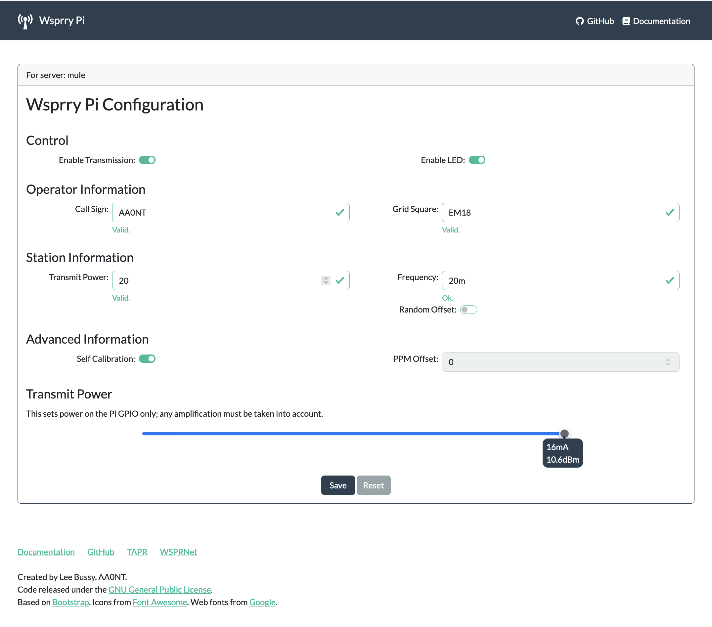

# Web UI Operations

All normal control operations revolve around the Wsprry Pi's configuration file. This file is manipulated by a web UI and accessed by the `wsprrypi` executable. If wsprrypi is running, a change to this file will take effect at the next transmission period, which is the top of an even minute for normal WSPR, or at the top of the quarter hour for -15 operations. If wsprrypi is not actively transmitting and you change the transmit selection, the system will apply the changes at the next proper WSPR window.

The web interface is designed to be a simple-to-use yet comprehensive interface to the wsprrypi program and configuration.

Since the wsprrypi application runs as a system daemon, the web page saves the configuration and is picked up immediately by the wsprrypi application.

Configuration items:

- Control
  - Enable Transmission
    - Off: While the transmission is disabled, the wsprrypi program will still run and monitor the configuration for changes.
    - On: The wsprrypi program will transmit based on the saved configuration.
  - Enable LED: The TAPR Pi Hat includes a red LED attached to Pin 12 (GPIO18, BCM18). When enabled, this LED will light during transmission.
- Operator Information
  - Call Sign: This should be your registered callsign. Please do not make things up or use another person's callsign. It is illegal and immoral, and you will eventually annoy someone enough for them to find and report you.
  - Grid Square: The Maidenhead Locator System coordinates, also called QTH locators, grid locators, or grid squares. Use the first four digits only; two letters followed by two numbers.
- Station Information
  - Transmit Power: Transmit power in dBm. This entry is informational for the WSPR packet and does not affect the energy used to transmit the message. Typically, this value is 10, representing the Raspberry Pi's signal power capability. If you are using the TAPR hat, it includes an amplifier raising this dBm level to 20.
  - Frequency: Frequencies can be specified as an absolute TX carrier frequency (e.g., 14097100 for 20-meter WSPR) or using one of the strings in the table below. If you use a string, the transmission will happen in the middle of the WSPR region of the selected band. You may use multiple frequencies separated by spaces; wsprrypi will iterate through them in order. A 0 as a frequency is used in a frequency list to establish a transmission window gap. The web page will validate the entries and attempt to disallow an improper entry.

| Frequency Designator | Frequency in Hz |
| --- | --- |
| LF | 137500 |
| LF-15\* | 137612.5 |
| MF | 475700 |
| MF-15 | 475812.5 |
| 160m | 1838100 |
| 160m-15\* | 1838212.5 |
| 80m | 3570100 |
| 60m | 5288700 |
| 40m | 7040100 |
| 30m | 10140200 |
| 20m | 14097100 |
| 17m | 18106100 |
| 15m | 21096100 |
| 12m | 24926100 |
| 10m | 28126100 |
| 6m | 50294500 |
| 4m | 70092500 |
| 2m | 144490500 |

\*The `-15` suffix indicates the WSPR-15 region of the band.

  - Random Offset: Add a random frequency offset to each transmission:
    - +/- 80 Hz for WSPR
    - +/- 8 Hz for WSPR-15
- Advanced Information
  - Self Calibration: This is an exclusive setting with PPM Offset below. If enabled (default,) wsprrypi will use NTP to to obtain the PPM error of the Raspberry Pi's crystal.
  - PPM Offset: This is an exclusive setting with Self Calibration above. If Self Calibration is disabled, you may manually enter the configuration value for the Raspberry Pi's crystal offset.
- Transmit Power: This slider will set the transmit power to one of eight levels. This feature is for people running on experimental frequencies which need to limit transmission power. The default is 16mA / 10.6dBm. These levels are estimated at the Raspberry Pi GPIO according to Broadcom documentation. They do not consider any amplification, such as on the TAPR board.  The settings are:

  0. 2mA / -3.4dBm
  1. 4mA / 2.1dBm
  2. 6mA / 4.9dBm
  3. 8mA / 6.6dBm
  4. 10mA / 8.2dBm
  5. 12mA / 9.2dBm
  6. 14mA / 10.0dBm
  7. 16mA / 10.6dBm

- Save: Applies the currently displayed configuration. If any fields fail the basic checks, the field will be red and not allow saving. The changes may take time to change what wsprrypi is doing; if wsprrypi is actively transmitting, wsprrypi will use the configuration change after the current transmission window ends.
- Reset: Reloads the configuration page from the system.
