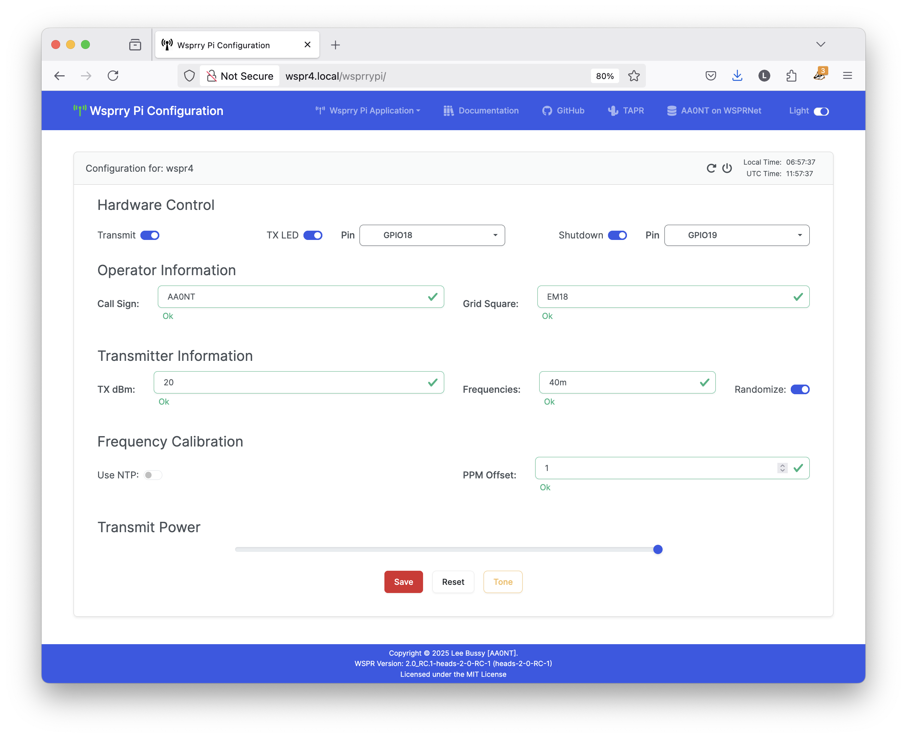
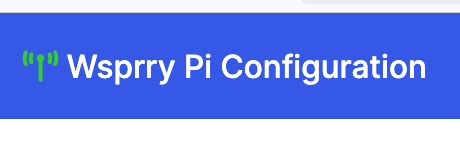
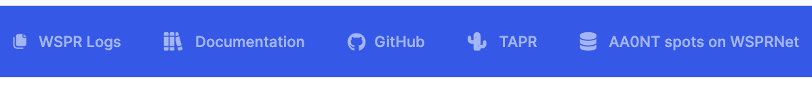
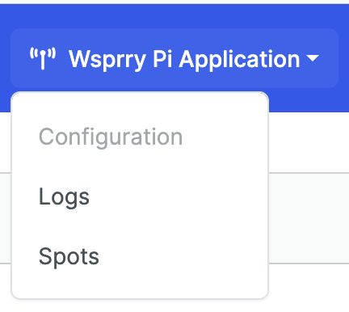
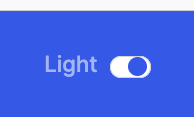
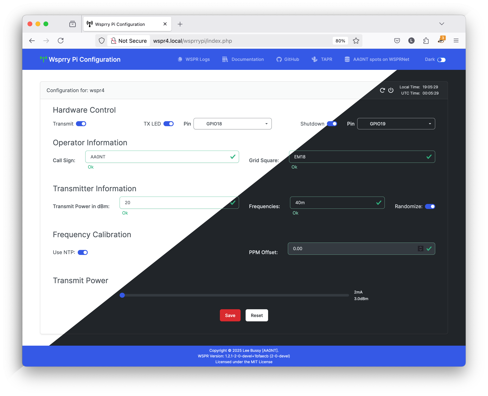
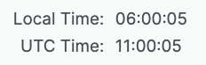

<!-- Grammar and spelling checked -->
# Web UI Operations

The web interface is designed to be a simple-to-use yet comprehensive interface to the Wsprry Pi program and configuration.  I'll explain the UI from top to bottom.

## Navbar

The navbar is the blue bar pinned to the top of the web page:

### Transmission Indicator

The antenna icon turns color depending on the status of the application:

- **Red:** Indicates the web page is disconnected from the application.  The web page was just opened, and the connection to the Web Socket has not yet been negotiated.  The daemon may not be running or remaining started if it remains red.
- **Orange:** Indicates the web page is negotiating the connection to the application.
- **Yellow/Gold:** Indicates the web page is connected to the application, but no transmission is in progress.
- **Green:** Indicates a transmission is in progress.

For those of you impacted by a type of color-blindness that may make this less valuable, you may hover over the icon for a textual indicator.

### WSPR Links

- **Wsprry Pi Application:** A drop-down is available on each page with links to the Wsprry Pi pages.
- **Documentation:** Opens the online documentation in a new tab.
- **GitHub:** Since this is an open-source project, this links to the source code repository where issues may be raised and where you should consider contributing if you are technically inclined.
- **TAPR:** A link in a new tap to our favorite non-profit 501(c)(3) organization of amateur radio operators who are interested in advancing the state of the radio art.
- **WSPRNet Spots:** This will open the WSPRNet database, and if your call sign is configured, it will go directly to your most recent spots.

#### Wsprry Pi Application

Three pages are available here:

- **Configuration:** The main Wsprry Pi page; this is where you will configure and control your rig.
- **Logs:** The log page provides a view of the 500 most recent log entries for the Wsprry Pi daemon.  Full logs from the command line are still available, but this will be enough for most folks' casual use.
- **Spots:** Courtesy of [WSPR Live](https://wspr.live/wspr_downloader.php?), this page will show you your last 60 minutes of spots.  It will also refresh every five minutes, so no manual refreshes are required.  This is a free service, so please do not abuse the service with rapid manual refreshes.

### Web Page Mode

Yes, Virginia, there is a Santa Claus!  New Wsprry Pi now with DARK MODE!

## Card Header

Each page contains a "card," which has a similar header.  The header is the shaded region at the top of the configuration card.

### Card Info

Contextual information about what page/card you are viewing is on the left side of each card header.

#### Server Control

On the top right side before the clock are server control icons:

The icon to the left, the arrow in a circle, is to reboot your Pi.  When you select this, a visual indicator will appear via the transmission LED (if configured).  It will flash two times and then reboot.

The arrow to the right, the circle with the vertical line, will power off the Pi.  When selected, a visual indicator will appear via the transmission LED (if configured).  It will flash three times and then shut down immediately.  Remember that in most configurations, you will need to remove the power and re-power the Pi to start it again.

#### Clock

On the far right side of the card header is a clock displaying both local and UTC time:

## Application Pages / Card Bodies

The card body holds all of the available configuration options.  You may need to scroll to see some.  The layout is also designed to be responsive; that is, it should display in a usable manner on your cell phone and computer screen.

All changes must be saved via the save button before being applied to the system.
