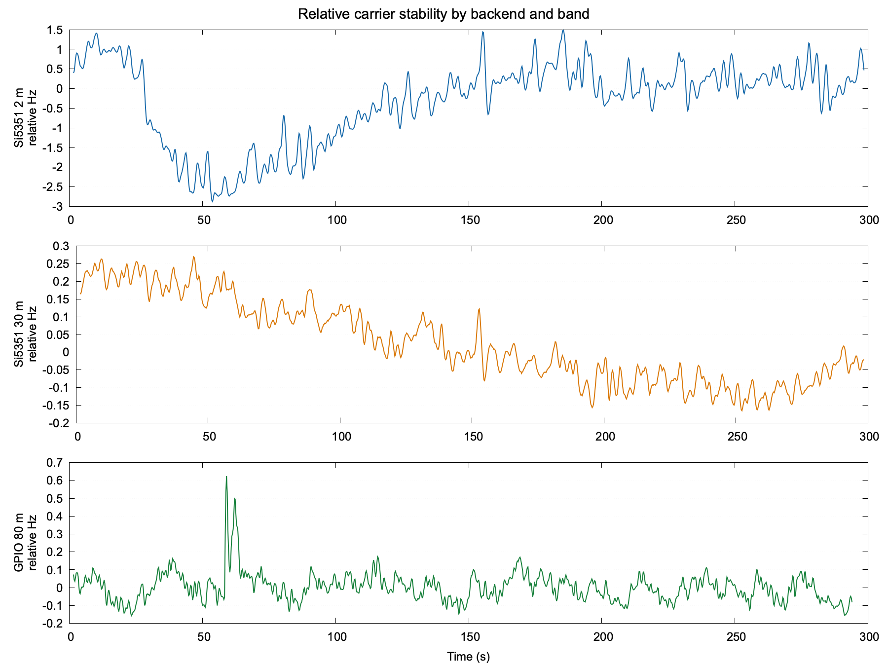
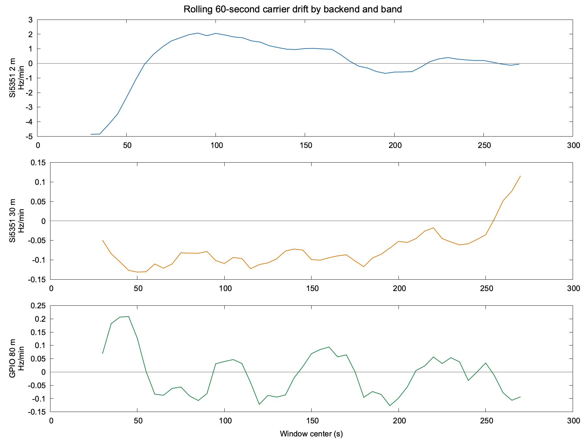

# Issue 379: Si5351 and GPIO steady-carrier stability characterization

Status: branch-local research evidence, not an operator specification or a
project default.

The repeatable conducted bench workflow is documented in
[`issue-379-conducted-qualification-procedure.md`](issue-379-conducted-qualification-procedure.md).

## Purpose

This document records steady-carrier behavior measured from the physical
Si5351/ATX-11 TCXO assembly on `wspr5` at 2 m, 4 m, 6 m, and 30 m, and the
GPIO/GPCLK0 output on `wspr4` at 80 m. It characterizes the two hardware paths
and the RSP1B measurement chain under the stated loads. It does not establish
release-wide hardware performance.

Absolute tuning accuracy is intentionally excluded. The installed
hardware-specific calibration remained unchanged, but each capture's constant
frequency offset was removed before stability metrics were calculated.

## Software qualification boundary

Issue 379 qualifies WsprryPi's ability to operate the Si5351 and GPIO/GPCLK
backends correctly and safely. Natural reference-oscillator accuracy, drift,
phase noise, spurs, harmonics, and thermal behavior belong to the selected
hardware and RF chain. They must be measured and retained so operators can
understand the platform, but a hardware characteristic is not by itself a
software failure.

Software qualification therefore requires evidence that each backend:

- calculates and applies the intended four WSPR tones and preserves their
  spacing;
- implements symbol timing and the complete 162-symbol sequence correctly;
- performs controlled transitions without software-created gaps, unintended
  frequencies, or avoidable phase discontinuities;
- fails closed on invalid input, partial hardware operations, interruption, and
  shutdown;
- restores the output hardware and services to the verified idle state; and
- produces bounded conducted frames that an independent WSPR decoder accepts.

Absolute carrier offset and continuous thermal drift are characterized at a
recorded operating condition. They become software defects only when the
software calculates, programs, sequences, or cleans up the hardware
incorrectly. A decoded-frame failure must likewise be diagnosed before it is
assigned to software or hardware.

## Si5351 test configuration

- Transmitter host: `wspr5`
- Backend: Si5351, `/dev/i2c-1`, address `0x60`, CLK0, 2 mA
- Reference oscillator: ATX-11-F-27.000MHZ-F05-T TCXO
- Tones:
  - 2 m tone 0: `144.490497802734375 MHz`
  - 30 m tone 0: `10.140197802734375 MHz`
- RF path: shielded 50-ohm load with 30 dB series attenuation
- Receiver: SDRplay RSP1B serial `2404058C60`
- Receiver configuration: 250 kS/s, AGC off, fixed 25 dB requested and actual
  gain
- Capture duration: 300 seconds per band, sequentially, 2 m first
- Samples: 75,000,000 complex-float samples per band
- Receiver overflows: zero
- Installed calibration: `+2.353615654 ppm`, unchanged and not used to correct
  relative stability
- Observed CPU temperatures:
  - session start: 41.7 C
  - 2 m start/end: 41.7 C / 42.8 C
  - 30 m start/end: 43.9 C / 44.4 C

Before and after each tone, Si5351 register 3 was `0xFF`. After the session,
`wsprrypi.service` and `soapyremote-server.service` were active and no test
process remained.

## GPIO test configuration

- Transmitter host: `wspr4`, Raspberry Pi 4 Model B Rev 1.1
- Backend: GPIO/GPCLK0 on BCM GPIO 4, power level 7
- Tone: 80 m tone 0, `3.570097802734375 MHz`
- Band constraint: the installed hard 80 m LPF limited this host to 80 m
- RF path: GPIO 4, hard 80 m LPF, transferred attenuation/load, RSP1B
- Receiver host: `wspr5`
- Receiver: SDRplay RSP1B serial `2404058C60`
- Receiver configuration: 250 kS/s, AGC off, fixed 40 dB requested and actual
  gain
- Capture: 75,000,000 complex-float samples, 300 seconds, zero overflows
- Valid stability interval: 294.5 seconds after excluding 0.5 seconds at the
  start and five seconds at the end where analysis windows overlapped
  transmitter shutdown
- GPIO timing correction: `GPIO Use NTP = true`; Chrony reported 13.100 ppm
  fast at the start with -0.042 ppm residual frequency
- Configured `Calibration.PPM`: `0.0`; absolute accuracy remains excluded
- Transmitter temperature: 33.1 C at both start and end

The direct tone ran for 319.980 seconds and stopped on the wrapper's bounded
SIGINT. The post-run live audit found DMA inactive and detached, PWM disabled,
GPCLK0 disabled/not busy, and GPIO 4 restored to input. The audit passed,
`wsprrypi.service` and `soapyremote-server.service` were active, and no capture
or tone process remained.

## Analysis method

Each Si5351 IQ stream was translated by its nominal
receiver-to-carrier separation, coherently averaged into 10 ms blocks, and
trimmed by 0.5 seconds at each edge. Carrier frequency was estimated from
linear phase slope in two-second windows stepped every 0.25 seconds.

A constant frequency offset was removed independently from each capture. The
reported metrics therefore describe stability, not accuracy. Whole-run,
per-minute, and rolling 60-second linear fits were calculated. Phase continuity
was checked after removing a quadratic phase trend; no adjacent residual phase
change crossed the larger of pi/2 radians or eight robust standard deviations.

The observed residual includes both the transmitter and receiver references.
Because the captures were sequential rather than simultaneous, band-to-band
differences cannot be assigned exclusively to the Si5351 synthesis path.

The GPIO fractional-divider waveform did not satisfy the Si5351 estimator's
within-window phase-residual assumption. Applying it anyway produced a median
two-second phase-fit residual of 6.33 radians, so those results were rejected.
For GPIO, the IQ was instead translated and coherently integrated into 1 ms
blocks. A two-second Hann-window spectral peak was measured every 0.25 seconds
with a 32,768-point FFT. A broad discovery pass located the persistent carrier
near +43.4 Hz relative to the requested frequency; tracking was then confined
to the 40-to-47 Hz carrier lobe so isolated broadband-noise peaks could not be
mistaken for motion. That constant offset was removed from all stability
results. Median carrier contrast within the tracking interval was 20.48 dB.

The different estimators are a documented consequence of the backend
waveforms. Hertz and ppb results are useful hardware observations, but they are
not a controlled band-for-band performance ranking: backend, transmitter host,
band, LPF, attenuation, gain, and thermal history all differ.

## Whole-capture results

| Stability measure | Si5351 2 m | Si5351 30 m | GPIO 80 m |
|---|---:|---:|---:|
| Capture / analyzed duration | 300.0 / 299.0 s | 300.0 / 299.0 s | 300.0 / 294.5 s |
| Frequency estimates | 1,189 | 1,189 | 1,171 |
| Relative peak-to-peak movement | 4.369 Hz (30.24 ppb) | 0.436 Hz (42.97 ppb) | 0.782 Hz (218.96 ppb) |
| Central 90% movement | 3.354 Hz (23.21 ppb) | 0.357 Hz (35.26 ppb) | 0.213 Hz (59.79 ppb) |
| Whole-interval linear fit | +0.319 Hz/min | -0.074 Hz/min | -0.0122 Hz/min |
| RMS after linear-fit removal | 0.908 Hz (6.28 ppb) | 0.0477 Hz (4.70 ppb) | 0.0783 Hz (21.94 ppb) |
| Central 90% after fit removal | 3.513 Hz | 0.161 Hz | 0.220 Hz |
| Phase-discontinuity result | 0 detected | 0 detected | not comparable; spectral estimator |
| Median carrier contrast | phase-tracked | phase-tracked | 20.48 dB in tracking lobe |

The 30 m signal was approximately 72 dB weaker at the receiver. Its amplitude
span is consequently noise-sensitive and should not be compared directly with
the 2 m amplitude span. Phase coherence remained sufficient for carrier
tracking.

## Drift by minute

| Minute | Si5351 2 m drift / movement (Hz) | Si5351 30 m drift / movement (Hz) | GPIO 80 m drift / movement (Hz) |
|---:|---:|---:|---:|
| 1 | -4.855 / 4.289 | -0.049 / 0.146 | +0.067 / 0.782 |
| 2 | +2.076 / 2.865 | -0.078 / 0.196 | -0.081 / 0.633 |
| 3 | +1.016 / 2.458 | -0.099 / 0.203 | +0.069 / 0.316 |
| 4 | -0.561 / 2.066 | -0.045 / 0.186 | +0.004 / 0.231 |
| 5 | -0.061 / 1.785 | +0.116 / 0.183 | -0.093 / 0.258 |

The drift did not remain constant. At 2 m, the minute-five slope was about
1.2 percent of the first-minute magnitude. The carrier therefore settled
substantially, although short-term excursions remained. At 30 m, the slope was
negative through minute four and reversed positive during minute five; this is
also inconsistent with a constant-drift model.

The GPIO slope also alternated sign. Its movement decreased from 0.782 Hz in
minute one to 0.231 and 0.258 Hz in minutes four and five. That is consistent
with a settling observation, not a constant-drift model. The minute-five GPIO
row covers the valid portion through 295 seconds; shutdown-overlap windows are
excluded.

These are hardware-characterization results, not software acceptance failures.

## Frequency history

The panels use different vertical scales. Each trace is one uninterrupted tone;
the peaks and valleys are measured variation, not WSPR tone changes.

## Rolling drift rate

The rolling fit uses a 60-second window stepped every five seconds. It exposes
the slope changes hidden by a single five-minute linear fit.

## Interpretation

- Both bands produced a continuous, phase-coherent steady carrier for five
  minutes.
- The Si5351 path did not exhibit a fixed drift rate during either capture.
- The 2 m run provides evidence of substantial settling within five minutes.
- Settling does not mean the carrier becomes motionless; shorter excursions
  remain visible.
- The former proposed 0.5 Hz peak-to-peak drift limit is not used as a software
  pass/fail criterion. Drift is reported with the hardware and operating
  condition instead.
- These results characterize one hardware assembly and receiver chain. They do
  not define guaranteed WsprryPi behavior.
- The steady-carrier captures do not by themselves test tone spacing,
  transitions, symbol timing, or decoding. A separate bounded Si5351 frame
  test below covers those software-qualification questions.
- GPIO produced a persistent steady carrier through the valid 294.5-second
  observation. Its fractional-divider modulation required a spectral rather
  than phase-slope estimator, so phase-discontinuity results are not directly
  comparable with Si5351.
- GPIO was tested only at 80 m because of wspr4's hard LPF. These data must not
  be presented as an 80 m versus 2 m/30 m backend benchmark.
- GPIO's constant +43.4 Hz observation is retained only to identify the tracked
  lobe. It is not an accuracy result and is not a proposed PPM correction.

## Si5351 2 m bounded-frame qualification

Three attenuated frames using the valid repository reference identity
`AA0NT EM18 20` were transmitted on `wspr5` at the standard 2 m WSPR
frequency. Random offset was disabled. The RSP1B captured the frames at fixed
25 dB gain with zero overflows.

Each frame completed inside its bounded invocation and was decoded separately
with WSJT-X 2.7.0 `wsprd`:

| UTC start | Application duration | Retained decode |
|---|---:|---|
| 18:16 | 110.612196 s | `AA0NT EM18 20`, +18 dB |
| 18:30 | 110.611360 s | `AA0NT EM18 20`, +13 dB |
| 18:32 | 110.600065 s | `AA0NT EM18 20`, +18 dB |

The second and third frames used consecutive WSPR slots in one process bounded
to exactly two iterations and one uninterrupted receiver capture. Weak
companion decodes in the real-audio files are conjugate images from complex-IQ
conversion, not additional transmissions.

The decoder's 3.7 Hz/min drift estimate is a hardware observation and was not
treated as a symbol-spacing error. After separating slow carrier drift, the
four-tone fit measured 1.4849 Hz spacing against the 1.4648 Hz ideal, an error
of 0.0200 Hz.

The first retained frame contained 116 boundaries where the tone changed. At
100 us envelope resolution, the worst boundary bin was 1.61 dB below the
median symbol interior. No transition produced a carrier interruption reaching
-6 dB. Three successful independent decodes verify the complete symbol order
and usable transition timing under the measured drift.

After the bounded frame, Si5351 output-enable register 3 read `0xFF`, both
normal services were active, and no capture or transmitter process remained.
This satisfies Issue 379's requirement for three independently decoded bounded
Si5351 frames, as well as bounded shutdown and post-frame RF silence. The
measured adjacent-spacing error of 0.0200 Hz is inside the issue's +/-0.03 Hz
criterion. Multiplying the fitted spacing across three intervals implies a
4.4547 Hz span, approximately 0.0602 Hz above the 4.39453125 Hz ideal and
0.0102 Hz beyond the stated +/-0.05 Hz span criterion. The application
durations include process and shutdown overhead and therefore are not direct
measurements of the issue's symbol-level timing limits. Final closure must
either accept the complete-frame, transition, planner, and decoder evidence
with the measurement uncertainty stated, or retain the span and symbol-timing
items as unresolved. This document does not silently convert them into passes.

## Si5351 6 m and 4 m qualification

The 6 m and 4 m paths were tested on `wspr5` with the attenuated Si5351 CLK0
output at 2 mA and the local RSP1B at fixed 25 dB gain. The final carrier and
frame tests used the exact Issue 379 branch build at parent commit `93d01ea`
and WSPR-Transmitter commit `9efb288`.

Both steady tones formed narrow, usable carriers without receiver clipping:

| Band | Requested RF | Best 20 Hz share | RF-on/off contrast | Measured placement |
|---|---:|---:|---:|---:|
| 6 m | 50.294500 MHz | 95.95% | 67.81 dB | +5.15 Hz |
| 4 m | 70.092500 MHz | 99.10% | 66.34 dB | +6.10 Hz |

Three consecutive frames per band were transmitted with random offset disabled
and decoded independently with WSJT-X 2.7.0 `wsprd`:

| Band | UTC starts | Application durations | Intended decodes |
|---|---|---|---|
| 6 m | 17:46, 17:48, 17:50 | 110.624267, 110.599923, 110.599919 s | 3/3, `AA0NT EM18 20`, +18 dB |
| 4 m | 17:54, 17:56, 17:58 | 110.610520, 110.599832, 110.599894 s | 3/3, `AA0NT EM18 20`, +27 to +28 dB |

Each coherent 370-second receiver capture contained 92,500,000 samples with
zero overflows. Both transmitter processes and captures exited normally. After
each run, Si5351 register 3 read `0xFF`, the normal services were active, and
no transmitter, capture, or decoder process remained.

The first frame from each band recovered all 162 expected symbols without a
mismatch. Tone and transition measurements were:

| Band | Adjacent spacing error | Three-interval span error | Worst 100 us transition bin | Interruption below -6 dB |
|---|---:|---:|---:|---:|
| 6 m | -0.0097 Hz | -0.0290 Hz | -2.95 dB | None |
| 4 m | +0.0214 Hz | +0.0642 Hz | -1.49 dB | None |

The 4 m adjacent-spacing result is within the issue's +/-0.03 Hz criterion.
Its derived three-interval span is 0.0142 Hz beyond the earlier provisional
+/-0.05 Hz limit. This measured caveat is retained, but the complete decoded
frames, correct symbol order, continuous transitions, bounded operation, and
clean shutdown establish usable software operation. The maintainer therefore
accepted both 6 m and 4 m as qualified Si5351 bands.

Separate five-minute captures characterized the same hardware and receiver
chain. Constant frequency placement was removed before calculating stability:

| Band | Peak-to-peak movement | Central 90% movement | Whole-run slope | Detrended RMS |
|---|---:|---:|---:|---:|
| 6 m | 1.4606 Hz | 0.7871 Hz | -0.1193 Hz/min | 0.1737 Hz |
| 4 m | 2.2470 Hz | 1.6751 Hz | -0.2634 Hz/min | 0.4035 Hz |

Neither long capture contained a detected phase discontinuity. These
measurements characterize the TCXO, Si5351, RSP1B, and thermal state together;
they are not software pass/fail limits or project-wide frequency guarantees.

## GPIO VHF spectral-power concentration

Additional conducted GPIO tests on `wspr4` compared RF-on and RF-off spectra
from the fixed-gain RSP1B on `wspr5`. Transmitter-added power was calculated in
linear units over the captured +/-100 kHz region. The receiver center +/-1 kHz
was excluded, and only bins at least 6 dB above the RF-off baseline were
treated as resolved transmitter power. These are relative spectral-utilization
measurements, not calibrated watts. Harmonics outside the captured region are
not included.

| Test | Resolved power in the most useful 20 Hz | Power outside that 20 Hz | Narrow-channel penalty |
|---|---:|---:|---:|
| GPIO 6 m continuous output, `PPM=0` | 1.71% | 98.29% | -17.67 dB |
| GPIO 10 m continuous tone, `PPM=0` | 90.67% | 9.33% | -0.43 dB |
| GPIO 10 m WSPR, `PPM=0`, measured channel | 99.94% | 0.06% | -0.003 dB |
| GPIO 10 m WSPR, `PPM=+13.179`, measured channel | 99.95% | 0.05% | -0.002 dB |
| GPIO 10 m WSPR, `PPM=-13.179`, nominal channel | 99.52% | 0.48% | -0.021 dB |

The 6 m comb is a genuine power-distribution failure: no 20 Hz region contains
more than 1.71% of the resolved close-in output. The visible 10 m comb teeth
are different. They are conspicuous in RF-on/RF-off ratio plots because the
background is quiet, but the decoded WSPR captures retain more than 99.5% of
resolved close-in power inside one 20 Hz channel. At 10 m, incorrect frequency
placement was the dominant failure before PPM correction, not loss of useful
power into the comb.

The `PPM=0` 10 m frame was displaced about +371 Hz but decoded after receiver-
side translation. Three frames with `PPM=+13.179` moved to about +748 Hz and
decoded only after translation. Reversing the setting to `PPM=-13.179` placed
three consecutive frames within approximately -0.3 to +0.6 Hz of nominal, and
all decoded as `AA0NT EM18 20`. This direction-sensitive result led to Issue
#388. The measured value is specific to this Pi and receiver-reference
relationship and must not become a project default.

## GPIO band and pacing qualification

After the 80 m stability reproduction, the hard 80 m LPF was removed and the
attenuated GPIO 4 output on `wspr4` was measured with the fixed-gain RSP1B on
`wspr5`. The production `PWM_CLOCKS_PER_ITER_NOMINAL` value is 1000. Additional
builds at 4000 and 16000 were temporary test points; after every sweep the
published value 1000 was restored and rebuilt with three jobs. GPIO 4 was
returned to input and the normal services were restored.

The PPM value was held fixed within each comparison to isolate pacing behavior.
Absolute carrier placement is hardware-specific and is not the qualification
decision in this table.

| Band | 1000-clock result | 4000-clock result | 16000-clock result | GPIO disposition |
|---|---|---|---|---|
| 80 m | Prior steady-carrier and decoded-operation evidence; not reswept | Not tested | Not tested | Usable |
| 20 m | Strong carrier; 3/3 intended frames decoded at 5--6 dB | Strong carrier; 0/3 decoded | Strong carrier; 0/3 decoded | Qualified at 1000 |
| 15 m | Strong carrier; 3/3 frames decoded at 9--10 dB | Strong carrier; 0/3 decoded | Strong carrier; 0/3 decoded | Qualified at 1000 |
| 12 m\* | No usable requested-frequency carrier; 0/3 decoded | No usable carrier; 0/3 decoded | No usable carrier; 0/3 decoded | Disqualified |
| 10 m | Strong carrier; 3/3 frames decoded at 14--15 dB | Strong carrier; 0/3 decoded | Strong carrier; 0/3 decoded | Qualified at 1000 |
| 6 m | Severe spectral dispersion; no usable carrier | Not tested | Not tested | Disqualified |
| 2 m | No usable requested-frequency signal | Not tested | Not tested | Disqualified |

\* On a Raspberry Pi Zero 2 W (`BCM2837`-compatible SoC) running a 32-bit OS,
one of five complete captured 12 m frames decoded. The other four did not, so
the result did not satisfy the required three consecutive decodes. On the
Raspberry Pi 4 (`BCM2711`), none of nine 12 m frames decoded across the 1000-,
4000-, and 16000-clock test points, including 0/3 at the production 1000-clock
setting.

The result is not a monotonic frequency ceiling. GPIO works at 15 m, fails at
12 m, and works again at 10 m. Twelve metres is therefore a band-specific
integer-divider/dither pathology. Six metres disperses the transmitted power
across a broad comb, and 2 m also lies beyond the BCM2711 GPCLK documented
approximate 125 MHz maximum.

At 20, 15, and 10 m, changing the block size had little effect on the
unmodulated carrier:

| Band | Carrier at 1000 | Carrier at 4000 | Carrier at 16000 |
|---|---:|---:|---:|
| 20 m | -80.70 dBFS, +143.86 Hz | -80.72 dBFS, +142.90 Hz | -80.59 dBFS, +142.90 Hz |
| 15 m | -76.95 dBFS, +230.64 Hz | -76.72 dBFS, +229.69 Hz | -76.85 dBFS, +229.69 Hz |
| 10 m | -72.05 dBFS, +164.84 Hz | -72.18 dBFS, +161.98 Hz | -72.34 dBFS, +163.89 Hz |

The larger values nevertheless caused every WSPR frame to fail decoding. They
allow each integer-divider state to persist too long for the receiver to see
the intended WSPR tone average. A strong steady carrier is therefore not proof
of usable modulation. The production value 1000 is required by the tested
implementation; increasing it is not a valid 12 m cleanup strategy.

At 1000 clocks, the decoded center spread was 0.4 Hz over three frames at both
15 m and 10 m. The intended 20 m signal also decoded in all three frames. Each
20 m audio conversion produced weak companion decodes approximately 120 Hz on
either side of the intended decode. These are retained as cadence-related
spectral replicas, not additional transmissions, and require operator-facing
filtering guidance.

The uncorrected steady-tone offsets were not proportional to RF frequency:
approximately +144 Hz at 20 m, +231 Hz at 15 m, and +162 to +165 Hz at 10 m.
One oscillator PPM term cannot explain that non-monotonic placement. Integer-
divider selection and dither behavior contribute alongside the hardware clock
offset. Issue #388 separately tracks the sign convention used when applying
the Chrony-derived GPIO correction.

### Legacy_1.2.3 comparison on the same platform

The near-original `Legacy_1.2.3` GPIO implementation was also tested on the
same Raspberry Pi 4 (`BCM2711`) running 64-bit Trixie, using commit
`d9e4bf77f6b75ed9c82b21ad5516594dcca161de`. The pristine legacy source assumes
32-bit pointers and would not compile on this platform. Three pointer-width
compatibility changes were required for error printing and DMA address
arithmetic; frequency synthesis, modulation, calibration, output power, and
the production `PWM_CLOCKS_PER_ITER_NOMINAL=1000` value were left unchanged.

The comparison used GPIO 4, power level 7, free-running `PPM=0`, the same
attenuation, and the same fixed-gain RSP1B capture method. Each band had to
produce a usable continuous carrier before any WSPR frame would be attempted.

| Band | Legacy best 20 Hz share | Current implementation | Legacy result |
|---|---:|---:|---|
| 12 m | 0.0854% (-30.69 dB) | 0.1103% (-29.57 dB) | No usable coalesced carrier |
| 6 m | 0.1712% (-27.67 dB) | 1.7097% (-17.67 dB) | No usable coalesced carrier |

Both legacy tones failed the carrier gate, so no legacy WSPR frames were
transmitted. On this platform, 12 m is essentially the same non-coalesced
failure in the legacy and current implementations. Legacy 6 m was about 10 dB
worse in best-20-Hz power concentration, although both implementations are
unusable. This comparison does not support attributing either band failure to
the current WsprryPi software evolution; the original-era GPIO implementation
also failed on the tested platform.

### Fail-closed GPIO validation

The resulting policy was built and exercised on `wspr4`, a supported
Raspberry Pi 4 running 64-bit Trixie. Named WSPR requests and exact-frequency
Test Tone requests were submitted for 12 m, 6 m, and 2 m with GPIO 4 selected.
All six requests exited with the band-specific rejection before transmission.
The live startup-quiesce audit showed DMA and PWM disabled and unchanged before
and after the requests. GPIO 4 remained in its idle input state, and the normal
transmit-disabled service was restored successfully. Non-hardware coverage
also exercises WSPR, QRSS, FSKCW, DFCW, and Test Tone paths, boundary
frequencies, qualified GPIO bands, and the unaffected Si5351 path.

## Issue 379 closure disposition

- The Si5351 backend produced three independently decoded bounded 2 m frames,
  preserved the carrier through measured transitions, and restored the
  verified idle state. The accepted criterion separates repeatable software
  operation from hardware-specific oscillator accuracy and settling.
- The Si5351 backend also produced three independently decoded bounded frames
  at both 6 m and 4 m, recovered all 162 symbols per analyzed frame, preserved
  the carrier through every measured transition, and restored the verified
  idle state. Both bands are qualified with the retained 4 m span caveat.
- The GPIO backend cannot be qualified for 2 m on the tested supported
  Raspberry Pi path. It did not produce a usable requested-frequency signal,
  so the issue's three-decoded-frame requirement cannot be met. This is a
  formal backend-specific disqualification, not a failed claim that GPIO 2 m
  passed.
- GPIO support is band-specific. The retained evidence supports 80, 20, 15,
  and 10 m operation with the production pacing value and disqualifies 12, 6,
  and 2 m on this implementation. The same-platform `Legacy_1.2.3` comparison
  also failed to produce usable 12 m or 6 m carriers.
- Direct GPIO requests in the 12 m, 6 m, and 2 m band ranges now fail closed
  across WSPR, CW, scheduled, command-line, and Test Tone paths. Focused tests,
  full non-hardware regression, supported-Pi builds, and RF-inhibited live
  smoke validation passed. The Si5351 path remains available.
- The remaining closure work is publication of the transmitter, parent, and
  operator-documentation changes and reconciliation of the GitHub issue body.
- Hardware-specific absolute frequency, thermal drift, phase noise, spurs,
  harmonics, power, and RF-chain behavior remain characterization rather than
  project defaults or generic guarantees. Qualification does not authorize
  on-air operation.

## Retained evidence

The repository retains the reviewed combined plots and backend-specific
machine-readable results beside this document:

- `summary.json`: whole-capture results
- `minute-summary.csv`: per-minute slopes and movement
- `rolling-60s-drift.csv`: rolling-slope series
- `frequency-series.csv`: all two-second carrier estimates
- `gpio-80m-summary.json`: GPIO whole-capture results and estimator contract
- `gpio-80m-minute-summary.csv`: GPIO per-minute slopes and movement
- `gpio-80m-rolling-60s-drift.csv`: GPIO rolling-slope series
- `gpio-80m-frequency-series.csv`: GPIO carrier estimates and contrast
- `gpio-80m-capture.log`: receiver identity, settings, samples, and overflows
- `gpio-80m-session.log`: transmitter conditions and duration
- `gpio-80m-quiesce.log`: post-run live hardware audit
- `si5351-2m-frame-summary.json`: concise frame and acceptance measurements
- `si5351-2m-transition-analysis.json`: transition-envelope measurements
- `si5351-2m-frame-session.log`: bounded session conditions and exit status
- `si5351-2m-frame-transmit.log`: application frame timing and shutdown
- `si5351-2m-frame-capture.log`: receiver identity, settings, and overflows
- `si5351-2m-frame-wsprd.log`: independent WSJT-X decode output
- `si5351-2m-three-frame-summary.json`: all three frame/decode results
- `si5351-2m-two-more-session.log`: two-frame bounded session evidence
- `si5351-2m-two-more-transmit.log`: both application frame durations
- `si5351-2m-two-more-capture.log`: continuous receiver capture result
- `si5351-2m-frame-1830-wsprd.log`: second independent decode
- `si5351-2m-frame-1832-wsprd.log`: third independent decode
- `si5351-6m-4m-qualification-summary.json`: carrier, frame, spacing,
  transition, cleanup, and disposition results for both bands
- `si5351-6m-frame-analysis.json` and `si5351-4m-frame-analysis.json`: symbol
  recovery and tone-spacing measurements
- `si5351-6m-transition-analysis.json` and
  `si5351-4m-transition-analysis.json`: transition-envelope measurements
- `si5351-6m-three-frame-session.log` and
  `si5351-4m-three-frame-session.log`: bounded transmitter/capture sessions
- `si5351-6m-frame-{1746,1748,1750}-wsprd.log`: independent 6 m decodes
- `si5351-4m-frame-{1754,1756,1758}-wsprd.log`: independent 4 m decodes
- `si5351-6m-4m-stability-summary.json`: five-minute relative-stability
  results
- `si5351-6m-4m-frequency-series.csv` and
  `si5351-6m-4m-rolling-60s-drift.csv`: retained long-run series
- `si5351-6m-4m-relative-frequency.png` and
  `si5351-6m-4m-rolling-drift.png`: long-run comparison plots
- `gpio-vhf-spectral-utilization.json`: relative 6 m/10 m close-in power budget
- `gpio-band-cadence-qualification.json`: band disposition and 1000/4000/16000
  pacing results for 10, 12, 15, and 20 m
- `gpio-fail-closed-validation.json`: supported-Pi build, regression, blocked
  request, hardware-quiescence, and service-restoration results

The larger working evidence remains outside the repository:

- local analysis bundle: `long-stability-results/`
- raw IQ on `wspr5`: `/home/pi/issue379-long-stability/`
- GPIO raw IQ on `wspr5`:
  `/home/pi/issue379-gpio-stability/gpio-80m-300s.cf32`
- Si5351 decoded-frame raw IQ on `wspr5`:
  `/home/pi/issue379-si5351-frame-valid/si5351-2m-frame-valid.cf32`
- Two additional decoded-frame raw IQ on `wspr5`:
  `/home/pi/issue379-si5351-two-more-frames/si5351-2m-two-more.cf32`
- Si5351 6 m and 4 m steady-carrier, frame, decode, and analysis artifacts on
  `wspr5`: `/home/pi/issue379-si5351-6m-4m/` and
  `/home/pi/issue379-si5351-6m-4m-current/`
- GPIO cadence-sweep raw IQ and decoder artifacts on `wspr5`:
  `/home/pi/issue379-gpio-{10m,12m,15m,20m}-{tone,3frame}-block*`
- Same-platform `Legacy_1.2.3` comparison report and tone captures on `wspr5`:
  `/home/pi/legacy123-gpio-comparison/REPORT.md` and
  `/home/pi/legacy123-gpio-{12m,6m}-tone-ppm0/`
- Legacy transmitter session, cleanup, and GPIO-quiesce logs on `wspr4`:
  `/home/pi/legacy123-gpio-{12m,6m}-tone-ppm0/`

The steady-carrier IQ files are 600 MB each, the first frame IQ file is 260 MB,
and the two-frame IQ file is 500 MB. They are intentionally not committed to
the repository.
