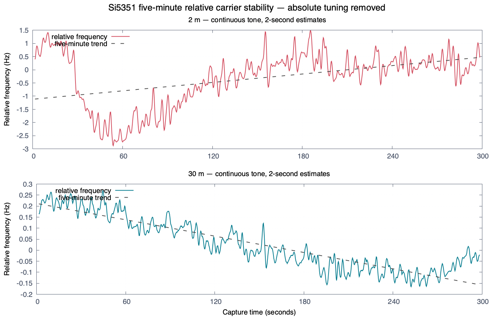
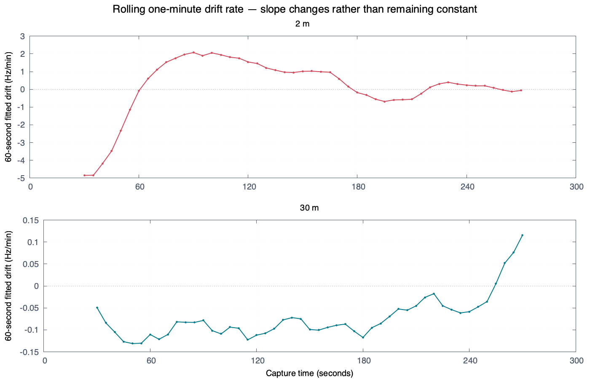

# Issue 379: Si5351 steady-carrier stability characterization

Status: branch-local research evidence, not an operator specification or a
project default.

## Purpose

This document records steady-carrier behavior measured from the physical
Si5351/ATX-11 TCXO assembly on `wspr5`. It characterizes the hardware and the
RSP1B measurement chain under the stated load. It does not identify a software
limitation, qualify GPIO transmission, or establish release-wide hardware
performance.

Absolute tuning accuracy is intentionally excluded. The installed
hardware-specific calibration remained unchanged, but each capture's constant
frequency offset was removed before stability metrics were calculated.

## Software qualification boundary

Issue 379 qualifies WsprryPi's ability to operate the Si5351 and GPIO/GPCLK
backends correctly and safely. Natural reference-oscillator accuracy, drift,
phase noise, spurs, harmonics, and thermal behavior belong to the selected
hardware and RF chain. They must be measured and retained so operators can
understand the platform, but a hardware characteristic is not by itself a
software failure.

Software qualification therefore requires evidence that each backend:

- calculates and applies the intended four WSPR tones and preserves their
  spacing;
- implements symbol timing and the complete 162-symbol sequence correctly;
- performs controlled transitions without software-created gaps, unintended
  frequencies, or avoidable phase discontinuities;
- fails closed on invalid input, partial hardware operations, interruption, and
  shutdown;
- restores the output hardware and services to the verified idle state; and
- produces bounded conducted frames that an independent WSPR decoder accepts.

Absolute carrier offset and continuous thermal drift are characterized at a
recorded operating condition. They become software defects only when the
software calculates, programs, sequences, or cleans up the hardware
incorrectly. A decoded-frame failure must likewise be diagnosed before it is
assigned to software or hardware.

## Test configuration

- Transmitter host: `wspr5`
- Backend: Si5351, `/dev/i2c-1`, address `0x60`, CLK0, 2 mA
- Reference oscillator: ATX-11-F-27.000MHZ-F05-T TCXO
- Tones:
  - 2 m tone 0: `144.490497802734375 MHz`
  - 30 m tone 0: `10.140197802734375 MHz`
- RF path: shielded 50-ohm load with 30 dB series attenuation
- Receiver: SDRplay RSP1B serial `2404058C60`
- Receiver configuration: 250 kS/s, AGC off, fixed 25 dB requested and actual
  gain
- Capture duration: 300 seconds per band, sequentially, 2 m first
- Samples: 75,000,000 complex-float samples per band
- Receiver overflows: zero
- Installed calibration: `+2.353615654 ppm`, unchanged and not used to correct
  relative stability
- Observed CPU temperatures:
  - session start: 41.7 C
  - 2 m start/end: 41.7 C / 42.8 C
  - 30 m start/end: 43.9 C / 44.4 C

Before and after each tone, Si5351 register 3 was `0xFF`. After the session,
`wsprrypi.service` and `soapyremote-server.service` were active and no test
process remained.

## Analysis method

Each uninterrupted IQ stream was translated by its nominal
receiver-to-carrier separation, coherently averaged into 10 ms blocks, and
trimmed by 0.5 seconds at each edge. Carrier frequency was estimated from
linear phase slope in two-second windows stepped every 0.25 seconds.

A constant frequency offset was removed independently from each capture. The
reported metrics therefore describe stability, not accuracy. Whole-run,
per-minute, and rolling 60-second linear fits were calculated. Phase continuity
was checked after removing a quadratic phase trend; no adjacent residual phase
change crossed the larger of pi/2 radians or eight robust standard deviations.

The observed residual includes both the transmitter and receiver references.
Because the captures were sequential rather than simultaneous, band-to-band
differences cannot be assigned exclusively to the Si5351 synthesis path.

## Whole-capture results

| Stability measure | 2 m | 30 m |
|---|---:|---:|
| Capture duration | 300.0 s | 300.0 s |
| Frequency estimates | 1,189 | 1,189 |
| Relative peak-to-peak movement | 4.369 Hz (30.24 ppb) | 0.436 Hz (42.97 ppb) |
| Central 90% movement | 3.354 Hz (23.21 ppb) | 0.357 Hz (35.26 ppb) |
| Five-minute linear fit | +0.319 Hz/min | -0.074 Hz/min |
| RMS after five-minute linear-fit removal | 0.908 Hz (6.28 ppb) | 0.0477 Hz (4.70 ppb) |
| Central 90% after fit removal | 3.513 Hz | 0.161 Hz |
| Detected phase discontinuities | 0 | 0 |
| Amplitude central 90% span | 0.164 dB | 3.293 dB |
| Amplitude peak-to-peak span | 0.356 dB | 8.060 dB |

The 30 m signal was approximately 72 dB weaker at the receiver. Its amplitude
span is consequently noise-sensitive and should not be compared directly with
the 2 m amplitude span. Phase coherence remained sufficient for carrier
tracking.

## Drift by minute

| Minute | 2 m drift (Hz/min) | 2 m movement (Hz p-p) | 30 m drift (Hz/min) | 30 m movement (Hz p-p) |
|---:|---:|---:|---:|---:|
| 1 | -4.855 | 4.289 | -0.049 | 0.146 |
| 2 | +2.076 | 2.865 | -0.078 | 0.196 |
| 3 | +1.016 | 2.458 | -0.099 | 0.203 |
| 4 | -0.561 | 2.066 | -0.045 | 0.186 |
| 5 | -0.061 | 1.785 | +0.116 | 0.183 |

The drift did not remain constant. At 2 m, the minute-five slope was about
1.2 percent of the first-minute magnitude. The carrier therefore settled
substantially, although short-term excursions remained. At 30 m, the slope was
negative through minute four and reversed positive during minute five; this is
also inconsistent with a constant-drift model.

These are hardware-characterization results, not software acceptance failures.

## Frequency history

The panels use different vertical scales. Each trace is one uninterrupted tone;
the peaks and valleys are measured variation, not WSPR tone changes.

## Rolling drift rate

The rolling fit uses a 60-second window stepped every five seconds. It exposes
the slope changes hidden by a single five-minute linear fit.

## Interpretation

- Both bands produced a continuous, phase-coherent steady carrier for five
  minutes.
- The Si5351 path did not exhibit a fixed drift rate during either capture.
- The 2 m run provides evidence of substantial settling within five minutes.
- Settling does not mean the carrier becomes motionless; shorter excursions
  remain visible.
- The former proposed 0.5 Hz peak-to-peak drift limit is not used as a software
  pass/fail criterion. Drift is reported with the hardware and operating
  condition instead.
- These results characterize one hardware assembly and receiver chain. They do
  not define guaranteed WsprryPi behavior.
- This evidence does not test WSPR tone spacing, tone transitions, symbol
  timing, a complete WSPR frame, or the GPIO backend.

## Required GPIO reproduction on wspr4

The GPIO test must reproduce the measurement question, not the Si5351 register
procedure. It requires separate live-RF authorization and confirmation of the
connected attenuated load before execution.

### Controlled conditions

1. Use `wspr4`, the GPIO transmitter output and pin selected by the installed
   configuration, and the same shielded 50-ohm load plus attenuation used for
   prior GPIO qualification.
2. Connect the same RSP1B measurement chain where practical. Disable AGC and
   use one fixed receiver-gain setting for both bands. Record requested and
   actual gain.
3. Record the exact GPIO pin, peripheral clock source, configured GPIO PPM
   behavior, NTP/Chrony state, load, attenuation, receiver serial, sample rate,
   center frequency, start/end temperature, uptime, and band order.
4. Use one uninterrupted tone-0 transmission for 300 seconds at
   `144.490497802734375 MHz`, followed by one at
   `10.140197802734375 MHz`. If band order is reversed, record it rather than
   silently comparing against this run as though thermal history were equal.
5. Capture 75,000,000 CF32 samples at 250 kS/s for each band, with zero SDR
   overflows. Treat an interrupted or overflowed capture as invalid.
6. Restore the GPIO output to its verified idle state, restart any stopped
   services, and record the cleanup evidence before analysis.

### GPIO analysis and result contract

Apply the same stability-only analysis:

- remove one constant frequency offset independently per capture;
- use 10 ms coherent blocks;
- fit two-second phase-slope windows every 0.25 seconds;
- report whole-run peak-to-peak and central-90-percent movement;
- report the five-minute fitted drift rate;
- remove that fit and report residual RMS and central-90-percent movement;
- report phase discontinuities and amplitude variation;
- report per-minute slopes and peak-to-peak movement;
- plot the relative frequency history and rolling 60-second slope;
- express hertz results fractionally in ppb for cross-band comparison;
- leave PPM and reference-based absolute accuracy outside the stability
  conclusion.

### Comparison questions

The GPIO reproduction should answer:

1. Does GPIO produce a continuous phase-coherent carrier for five minutes on
   each band?
2. Is its drift approximately constant, does it settle, or does it reverse?
3. How do absolute-hertz and fractional-ppb movement scale between 30 m and
   2 m?
4. Does GPIO show discontinuities or steps absent from the Si5351 capture?
5. After removing slow drift, is GPIO short-term fractional variation better,
   similar, or worse than the Si5351 path?

The answers characterize the GPIO-based hardware platform. A measured offset
or drift does not fail WsprryPi software unless retained control and calculation
evidence shows that the software introduced it. Software acceptance remains
based on correct planning, timing, transitions, safe lifecycle behavior, and
independently decoded bounded frames.

GPIO results must remain backend-specific. They must not replace, qualify, or
invalidate the Si5351 evidence solely because the two backends share an issue.

## Retained evidence

The repository retains the two reviewed plots and these machine-readable
results beside this document:

- `summary.json`: whole-capture results
- `minute-summary.csv`: per-minute slopes and movement
- `rolling-60s-drift.csv`: rolling-slope series
- `frequency-series.csv`: all two-second carrier estimates

The larger working evidence remains outside the repository:

- local analysis bundle: `long-stability-results/`
- raw IQ on `wspr5`: `/home/pi/issue379-long-stability/`

The raw IQ files are 600 MB each and are intentionally not committed to the
repository.
